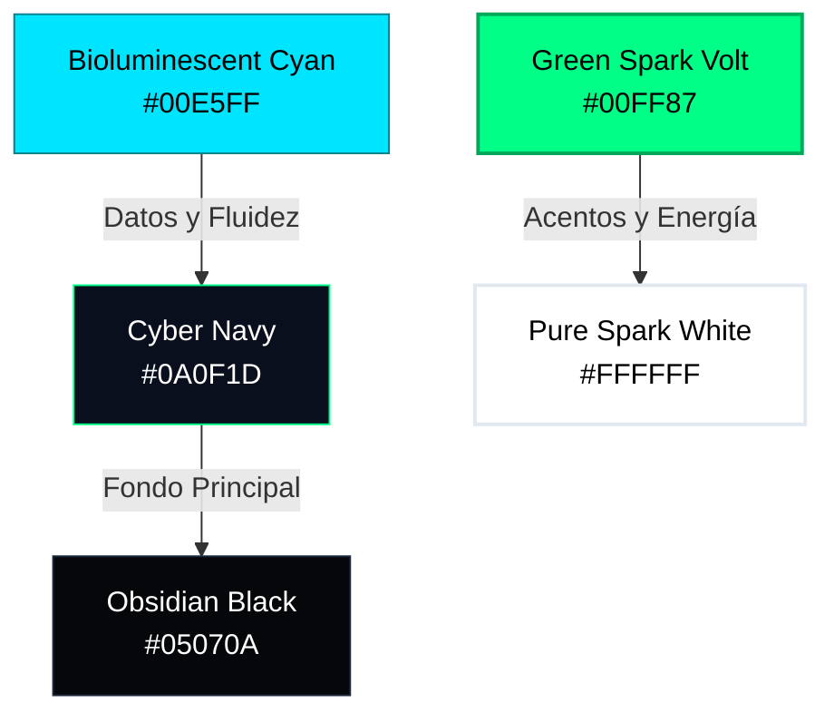
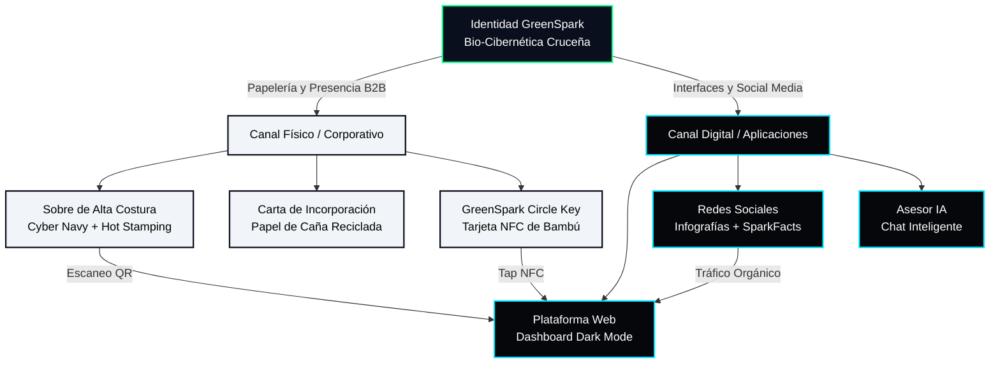

# Design System: GreenSpark ⚡🌱

**Proyecto:** GreenSpark · **Mención:** ENERGÍA · **Equipo:** HackHeroes  
**Lugar:** Santa Cruz de la Sierra, Bolivia  
**Propósito:** Capa de Inteligencia Artificial para la Conversión de Residuos Orgánicos en Energía Rentable y Medible.

---

## 1. Visual Theme & Atmosphere: *"Bio-Cibernética Cruceña"*

La identidad visual de **GreenSpark** se define como una fusión de laboratorio de datos y selva tropical electrificada. No es una estética ecológica convencional de tonos tierra apagados y tipografías artesanales — es **ciencia de frontera, matemática optimizada e innovación radical**, envuelta en la vitalidad verde y la calidez humana de Santa Cruz de la Sierra.

El mood general es **denso, inmersivo y bioluminiscente**:

*   **Densidad Cibernética:** Fondos profundos, casi abisales, que evocan la interfaz de un centro de control energético o la consola de un sistema de deep learning en ejecución. El espacio negativo no es vacío — es el silencio antes del dato.
*   **Bioluminiscencia Eléctrica:** El residuo orgánico no es desecho: es energía latente. Visualizamos esa energía con un verde neón que simula la descarga de electrones en celdas microbianas — una luz que nace de la materia orgánica misma, no de una bombilla decorativa.
*   **Cercanía Cruceña:** Conectamos la vegetación densa del Urubó y la exuberancia del llano con el crecimiento urbano exponencial de la metrópoli. El resultado es tecnología de altísimo nivel, pero con un carácter accesible, transparente y profundamente local para ciudadanos, empresas, universidades y socios institucionales.

> **Palabras clave de la atmósfera:** Inmersivo · Bioluminiscente · Científico · Premium · Accesible · Orgullosamente Cruceño.

---

## 2. Color Palette & Roles

La paleta cromática está construida sobre tres pilares — **verde tecnológico, blanco puro y tonalidades oscuras** — que en conjunto proyectan una imagen de ciencia, innovación y vanguardia sin perder la calidez de marca.

### 2.1. Colores Primarios

| Token de Diseño | Color | Hex | HSL | Rol Funcional |
|---|---|---|---|---|
| **Green Spark Volt** | Verde neón bioluminiscente con un leve matiz cian | `#00FF87` | 152°, 100%, 50% | Acciones primarias, botones CTA, estados activos, efectos de resplandor luminoso (*glow*), acentos tipográficos de máxima jerarquía visual. Es la "chispa" de la marca — el electrón visible. |
| **Cyber Navy** | Azul marino abismal, al borde del negro profundo | `#0A0F1D` | 225°, 48%, 8% | Fondos principales de la plataforma web, paneles laterales, contenedores estructurados (*cards*), y todo lienzo digital donde los datos cobran vida. Evoca la consola de un laboratorio de IA. |
| **Pure Spark White** | Blanco absoluto, de máximo contraste | `#FFFFFF` | 0°, 0%, 100% | Tipografía principal en interfaces dark mode, fondos de papelería física institucional, áreas de respiro visual. Es la claridad contra la profundidad. |

### 2.2. Colores Secundarios y de Apoyo

| Token de Diseño | Color | Hex | HSL | Rol Funcional |
|---|---|---|---|---|
| **Obsidian Black** | Negro casi total con un susurro de azul frío | `#05070A` | 220°, 33%, 3% | Fondo de la página web completa en dark mode para crear una ilusión de profundidad infinita detrás del Cyber Navy. Es la capa más profunda del universo visual. |
| **Bioluminescent Cyan** | Cian eléctrico, vibrante como un arco voltaico | `#00E5FF` | 186°, 100%, 50% | Gráficas de generación de energía (kWh), trazado de rutas logísticas de recolección en mapas, indicadores de rendimiento de IA, y datos secundarios que necesitan diferenciarse del verde primario. |
| **Eco-Fibre Gray** | Gris neutro ultra-claro con frialdad sutil | `#F1F5F9` | 210°, 40%, 96% | Fondos exclusivos para correspondencia física impresa (sobres, cartas, reportes ejecutivos) en papel ecológico. Nunca se usa en interfaces digitales. |
| **Slate Border** | Gris azulado apagado, casi invisible | `#1E293B` | 217°, 33%, 17% | Bordes sutiles de tarjetas y contenedores en la interfaz digital. Separadores visuales que estructuran sin competir con los colores luminosos. |

### 2.3. Gradientes del Sistema

| Nombre | Valores | Uso |
|---|---|---|
| **Deep Ocean** | `linear-gradient(180deg, #0A0F1D, #070B14)` | Interior de tarjetas y contenedores (*cards*) — un degradado oscuro casi imperceptible que genera profundidad tridimensional sin recurrir a sombras pesadas. |
| **Volt Glow** | `radial-gradient(circle, rgba(0,255,135,0.15), transparent 70%)` | Halo ambiental detrás de elementos de datos críticos y KPIs — simula la bioluminiscencia irradiando desde el dato mismo. |
| **Horizon Fade** | `linear-gradient(180deg, #05070A 0%, #0A0F1D 50%, #0D1525 100%)` | Transición de fondos de página completa — la mirada viaja de la oscuridad absoluta a la profundidad estructurada del Cyber Navy. |

---

## 3. Typography Rules

La tipografía comunica **precisión matemática** con **amabilidad digital**. Tres familias tipográficas trabajan en conjunto para cubrir toda la jerarquía de información.

### 3.1. Familias Tipográficas

| Jerarquía | Familia | Fuente | Justificación |
|---|---|---|---|
| **Títulos e Identidad** | `Outfit` | Google Fonts | Sans-serif geométrica con terminaciones limpias y curvas sutiles — proyecta futuro y cercanía al mismo tiempo. Sus formas redondeadas humanizan la precisión técnica. |
| **Cuerpo de Texto** | `Inter` | Google Fonts | Diseñada específicamente para legibilidad extrema en pantallas digitales a tamaños pequeños. Cada glifo está optimizado para renderizado en píxeles, garantizando claridad en tablas de datos, chats y descripciones técnicas. |
| **Datos y Código** | `JetBrains Mono` | Google Fonts | Monoespaciada con ligaduras opcionales — acentúa la naturaleza de desarrollo tecnológico y la precisión numérica del proyecto. Diferencia visualmente los datos duros del texto narrativo. |

### 3.2. Escala Tipográfica

| Elemento | Familia | Peso | Tamaño | Tracking | Uso |
|---|---|---|---|---|---|
| Título Hero (H1) | Outfit | ExtraBold (800) | 48–64px | -0.02em | Landing page, pantallas de presentación |
| Título de Sección (H2) | Outfit | Bold (700) | 28–36px | -0.01em | Encabezados de módulos del dashboard |
| Subtítulo (H3) | Outfit | SemiBold (600) | 20–24px | 0em | Subtítulos de tarjetas, nombres de métricas |
| Cuerpo | Inter | Regular (400) | 14–16px | 0em | Párrafos, descripciones, chat del asesor IA |
| Caption / Nota | Inter | Medium (500) | 12px | 0.02em | Pies de dato, confiabilidad de predicciones IA |
| Dato numérico | JetBrains Mono | Medium (500) | 14–32px | 0em | kWh, coordenadas GPS, coeficientes de IA |

---

## 4. Component Stylings

Los componentes de interfaz de GreenSpark siguen una filosofía de **oscuridad como lienzo + luz funcional como señal**. Cada elemento visual justifica su presencia.

### 4.1. Contenedores y Tarjetas (*Cards*)

*   **Forma:** Esquinas generosamente redondeadas (`border-radius: 12px`) — suavidad geométrica que evita la rigidez industrial sin caer en lo infantil.
*   **Fondo:** Gradiente **Deep Ocean** (de Cyber Navy `#0A0F1D` a `#070B14`) — una transición oscura casi imperceptible que genera profundidad.
*   **Borde:** Línea ultra-fina de 1px en **Slate Border** (`#1E293B`) — estructura sin competir.
*   **Sombra:** Ninguna sombra pesada. En estado activo o seleccionado, se enciende un resplandor perimetral verde de 2px (`box-shadow: 0 0 8px rgba(0, 255, 135, 0.3)`) — la tarjeta "cobra vida" al interactuar.

### 4.2. Botones Primarios (CTA)

*   **Forma:** Esquinas suavemente redondeadas (`border-radius: 8px`) — profesional y moderno.
*   **Fondo:** Sólido **Green Spark Volt** (`#00FF87`) — el color de máxima energía.
*   **Tipografía:** `Outfit Bold` en **Obsidian Black** (`#05070A`) — contraste absoluto sobre el verde brillante.
*   **Comportamiento:** Transición fluida de 300ms (`ease`). Al pasar el cursor, el botón irradia bioluminiscencia con una sombra difuminada pulsante: `box-shadow: 0 0 20px rgba(0, 255, 135, 0.5)`. El efecto comunica *"esta acción tiene energía"*.

### 4.3. Botones Secundarios

*   **Forma:** Esquinas suavemente redondeadas (`border-radius: 8px`) — consistencia con el primario.
*   **Fondo:** Transparente con borde de 1px en **Green Spark Volt** (`#00FF87`).
*   **Tipografía:** `Outfit SemiBold` en **Green Spark Volt** (`#00FF87`).
*   **Comportamiento:** Al hover, el fondo se llena con `rgba(0, 255, 135, 0.08)` — un verde fantasma que sugiere la acción sin gritar.

### 4.4. Campos de Entrada (*Inputs / Forms*)

*   **Fondo:** Ligeramente más claro que la tarjeta contenedora — `rgba(255, 255, 255, 0.04)` sobre el Cyber Navy.
*   **Borde:** Línea de 1px en **Slate Border** (`#1E293B`) en reposo. Al enfocar, transiciona a **Green Spark Volt** (`#00FF87`) con un resplandor suave.
*   **Texto de placeholder:** `Inter Regular` en `rgba(255, 255, 255, 0.4)` — susurra la instrucción sin competir con datos reales.
*   **Esquinas:** Generosamente redondeadas (`border-radius: 8px`) — consistencia total con botones.

### 4.5. Mapa de Rutas de Recolección (Google OR-Tools)

*   **Base cartográfica:** Mosaico oscuro personalizado (*Dark Map Tile*) donde calles y manzanas aparecen en gris carbón sobre fondo Obsidian — el mapa es el lienzo, no la figura.
*   **Rutas optimizadas por IA:** Trazadas en **Bioluminescent Cyan** (`#00E5FF`) con un trazo de 3px y un resplandor sutil — la ruta "fluye" como energía en un circuito.
*   **Plantas receptoras de biogás:** Marcadas con pines pulsantes en **Green Spark Volt** (`#00FF87`) que emiten una animación de onda concéntrica cada 2 segundos — simulan un latido energético.
*   **Generadores de residuo:** Pines estáticos en **Pure Spark White** con opacidad al 80%.

### 4.6. Chat del Asesor de Sostenibilidad IA

*   **Burbujas del agente:** Degradado oscuro sutil (variación del **Deep Ocean**), esquinas generosamente redondeadas, texto **Pure Spark White** con tipografía `Inter Regular` de alta legibilidad.
*   **Burbujas del usuario:** Fondo semitransparente `rgba(0, 255, 135, 0.1)` con borde fino verde — distinción clara sin agresividad visual.
*   **Indicador "Agente pensando...":** Onda de frecuencia animada en **Green Spark Volt** que pulsa horizontalmente — evoca la actividad cerebral del modelo procesando la consulta.
*   **Datos citados:** Aparecen en `JetBrains Mono` con fondo `rgba(0, 229, 255, 0.08)` — diferenciación inmediata de datos duros vs. texto conversacional.

---

## 5. Depth & Elevation

La interfaz de GreenSpark maneja la profundidad con **luz, no con sombra**. El paradigma visual es bioluminiscente: los elementos importantes emiten luz propia en lugar de proyectar sombras sobre capas inferiores.

| Nivel | Técnica | Ejemplo de Uso |
|---|---|---|
| **Nivel 0 — Abismo** | Fondo **Obsidian Black** (`#05070A`), sin decoración | Capa base de la página web completa |
| **Nivel 1 — Profundidad** | Fondo **Cyber Navy** (`#0A0F1D`), sin sombra | Paneles laterales, barras de navegación |
| **Nivel 2 — Superficie** | Gradiente **Deep Ocean**, borde **Slate Border** 1px | Tarjetas de contenido, contenedores de datos |
| **Nivel 3 — Elevado** | Gradiente **Deep Ocean** + resplandor verde perimetral 2px | Tarjetas activas, modales, tooltips expandidos |
| **Nivel 4 — Flotante** | Fondo con blur de 16px (`backdrop-filter: blur(16px)`) + borde verde brillante | Overlays, menús desplegables, diálogos de confirmación |

> **Principio rector:** Las sombras clásicas (drop-shadow oscura) están prohibidas en la interfaz. La profundidad se comunica exclusivamente a través de diferencias de luminosidad en los fondos y resplandores (*glows*) en los bordes — como organismos bioluminiscentes en la profundidad del océano.

---

## 6. Layout Principles

### 6.1. Espaciado y Retícula

*   **Sistema de spacing:** Escala de 4px (`4, 8, 12, 16, 24, 32, 48, 64, 96`). Todo margen, padding y gap entre elementos se alinea a este sistema — precisión matemática en cada pixel.
*   **Retícula base:** Grid de 12 columnas con gutters de 24px para desktop, colapsando a 4 columnas con gutters de 16px en mobile.
*   **Márgenes de página:** 32px en desktop, 16px en mobile — suficiente respiro sin desperdiciar el lienzo oscuro.

### 6.2. Principios de Composición

1.  **Oscuridad como Lienzo:** Todo nace del **Cyber Navy** (`#0A0F1D`). Las interfaces claras o fondos blancos en pantalla están prohibidas para mantener la estética científica y reducir el cansancio visual durante monitoreo constante.
2.  **Luz Funcional, no Decorativa:** El uso del verde brillante (`#00FF87`) debe estar justificado por la importancia de la acción o dato. Si todo brilla, nada es importante.
3.  **Trazabilidad Científica:** Cada dato, porcentaje o predicción energética incluye un pie de confiabilidad (ej. *"Predicción IA con ±3% de desviación basada en humedad local"*). Construye confianza con socios e inversionistas.
4.  **Localismo Orgulloso:** Mapas y ejemplos usan nombres reales de Santa Cruz (Equipetrol, El Trompillo, Plan 3000, la Ramada, el Urubó). Demostramos un entendimiento íntimo del territorio.
5.  **Transparencia de la IA:** La visualización refleja la inteligencia artificial de forma honesta — sin falsificar funcionalidades ni exagerar capacidades, en línea con las reglas de la Hackathon.

---

## 7. Corporate Identity & B2B Sales Kit: *"La Revelación Tecnológica"*

El proceso de incorporación de grandes generadores de residuos (universidades como la UCB, la UPSA o la UAGRM; corporaciones afiliadas a CAINCO y FEGASACRUZ) requiere una presencia física tan innovadora como el software mismo. La papelería institucional es el primer puente tangible del impacto digital de GreenSpark.

### 7.1. El Sobre de Presentación

*   **Exterior:** Papel kraft reciclado de fibra de caña de azúcar (insumo icónico de la agroindustria cruceña), prensado de alta densidad, teñido en **Cyber Navy** mate. En el centro, el logotipo de GreenSpark en estampado metálico caliente (*hot stamping*) verde-cian fluorescente. El diseño es minimalista extremo — solo el logo brillando sobre la oscuridad y un patrón geométrico de circuitos integrados que se desvanece en los bordes, sugiriendo la infraestructura tecnológica que contiene.
*   **Cierre:** Sello circular de sticker holográfico con un código QR funcional y la leyenda: *"Escaneá para medir el impacto latente de tus residuos antes de abrir"*. El QR dirige a una landing page personalizada con una simulación rápida de potencial energético para la institución.
*   **Interior:** Revestimiento en **Eco-Fibre Gray** (`#F1F5F9`) texturizado, con la siguiente frase en tipografía `Outfit SemiBold` centrada:

    > *"Estás abriendo la puerta a la soberanía energética de Santa Cruz de la Sierra."*

### 7.2. La Carta de Incorporación Institucional

*   **Material:** Impresa en papel ecológico certificado elaborado con residuo agroindustrial cruceño (bagazo de caña de azúcar de los ingenios del norte integrado). Textura orgánica táctil de alta calidad que el receptor siente al tocarla — la materia prima del papel es la misma que GreenSpark transforma en energía.
*   **Encabezado:** Logo GreenSpark alineado a la izquierda. A la derecha, en tipografía monoespaciada (`JetBrains Mono`) gris: `RED-SPARK // SOCIO-INNOVADOR // UCB-SCZ-2026`.
*   **Destinatario:** *A las Autoridades Académicas / Directores de Sostenibilidad* (personalizado por institución).
*   **Cuerpo de la carta:**

    > *"Nos complace certificar que su institución ha sido seleccionada para formar parte de la Red de Innovación Energética de Alto Nivel de GreenSpark.*
    >
    > *A partir de hoy, los residuos generados en sus comedores y áreas comunes ya no serán catalogados como basura o costos logísticos de desecho.*
    >
    > *Mediante nuestro sistema de Inteligencia Artificial predictivo, hemos identificado que los residuos orgánicos diarios de su campus tienen el potencial de iluminar aulas y laboratorios mediante un flujo de energía descentralizada y limpia, retornando además abono de alta calidad para el suelo de nuestro departamento.*
    >
    > *Ustedes ya no son solo un centro educativo; son una celda energética activa de la Santa Cruz del mañana."*

### 7.3. La GreenSpark Circle Key (Token de Acceso Físico)

Incrustada en un troquel central de la carta, la **GreenSpark Circle Key** es una tarjeta inteligente premium de bambú oscuro con chip NFC integrado y acabado mate. Al acercar el celular, se abre instantáneamente el portal dinámico de GreenSpark con el dashboard en tiempo real de la institución, mostrando toneladas desviadas del relleno sanitario y kWh generados.

*   **Material:** Bambú oscuro prensado, grabado láser con el logo y un código QR de respaldo.
*   **Dimensiones:** Formato tarjeta de crédito (85.6 × 53.98 mm).
*   **Tecnología:** Chip NFC NTAG215 — compatible con iOS y Android sin app adicional.
*   **Experiencia:** El receptor pasa de sostener un objeto físico premium a visualizar su impacto energético digital en segundos — el puente perfecto entre lo tangible y lo tecnológico.

---

## 8. Social Media Identity & Marketing: *"Cercanía de Alto Impacto"*

La estrategia en plataformas digitales (Instagram, LinkedIn, TikTok) equilibra la rigurosidad de la IA con la calidez del cruceño, humanizando datos complejos mediante analogías cotidianas y visuales explosivos.

### 8.1. Identidad Visual en Redes

*   **Grillas de Contenido:** Diseños con uso intensivo de retícula (*grid system*). Los marcos de las publicaciones emplean líneas delgadas y brillantes en **Green Spark Volt** y **Bioluminescent Cyan** que dividen el espacio con la precisión de un mapa logístico de optimización.
*   **Tipografía en Imágenes:** Títulos gigantes en `Outfit ExtraBold` blanco con palabras clave resaltadas en `#00FF87` y un sutil efecto de sombra luminosa detrás de las letras para despegarse del fondo oscuro.
*   **Imágenes de Contraste Extremo:** Fotografías de alta calidad del paisaje cruceño (el verde intenso del Urubó, el bullicio de mercados como el Abasto o la Ramada, campus universitarios) editadas con un filtro de alta fidelidad tecnológica, integrando infografías y elementos digitales 3D superpuestos que parecen flotar en el entorno.
*   **Paleta en Redes:** Fondos siempre oscuros (**Obsidian Black** o **Cyber Navy**). El blanco se reserva exclusivamente para tipografía de máxima jerarquía. El verde y el cian son los únicos colores de acento — jamás rojo, amarillo u otros que diluyan la identidad.

### 8.2. Formatos por Plataforma

| Plataforma | Formato Estrella | Tono de Voz | Frecuencia |
|---|---|---|---|
| **Instagram** | Carruseles de datos humanizados + Reels de "Detrás del Algoritmo" | Cercano, visual, con datos locales | 4–5 posts / semana |
| **LinkedIn** | Artículos técnicos + casos de éxito institucional | Profesional pero accesible, orientado a decisores | 2–3 posts / semana |
| **TikTok** | Reels educativos de 30–60s sobre IA y residuos | Informal, relajado, sin jerga excesiva | 3–4 videos / semana |

### 8.3. Tácticas de Contenido y Conexión Emocional

#### Táctica 1: La Humanización del kWh — *"¿Qué significa este dato para mí?"*

En lugar de publicar *"Generamos 150 kWh al mes"*, convertimos el dato en una historia visual con contexto cruceño:

*   **Slide 1:** *"¿Qué tienen en común tu almuerzo en Equipetrol y cargar tu celular por un año?"* — Fondo oscuro, foto premium de una hamburguesa cruceña típica con un aura verde brillante.
*   **Slide 2:** *"Ayer, la zona de Equipetrol desechó 500 kg de residuos orgánicos de restaurantes. Nuestra IA predijo que equivalen a 100 kWh de energía."* — Gráfica cian interactiva superpuesta en el mapa de Equipetrol.
*   **Slide 3:** *"Esa energía es suficiente para cargar 8.300 smartphones de cruceños de 0% a 100%."* — Ilustración digital de smartphones flotando con cables bioluminiscentes.
*   **Slide 4:** *"El futuro no se bota, se transforma. Únete a la red."* — Botón CTA limpio en Green Spark Volt.

#### Táctica 2: El Tablero de Honor Universitario — *#RedGreenSpark*

Publicaciones dedicadas a celebrar la integración de universidades locales:

*   Ejemplo: *"La UCB Sede Santa Cruz enciende la innovación"* con fotografía del rector sosteniendo la tarjeta NFC de bambú y capturas elegantes de su dashboard personalizado.
*   **Objetivo:** Generar sana competencia de sostenibilidad entre universidades (UCB vs. UPSA vs. UAGRM) y activar que los propios estudiantes compartan las publicaciones por orgullo de pertenencia.

#### Táctica 3: Detrás del Algoritmo — *"Build in Public"*

Videos cortos en formato Reel/TikTok de los desarrolladores de GreenSpark en Santa Cruz explicando cómo funciona scikit-learn o Google OR-Tools para optimizar rutas de recolección de basura por el 4to anillo. Tono cercano, relajado, sin jerga excesiva, mostrando pantallas de código reales con la estética oscura de GreenSpark.

*   **Formato:** 30–60 segundos, subtitulado, con transiciones rápidas.
*   **Estilo visual:** Fondo real (oficina, campus, calle cruceña) con overlays de la interfaz GreenSpark en esquina.

---

## 9. Brand Ecosystem & Communication Channels

El siguiente diagrama ilustra cómo fluye la identidad de marca a través de todos los canales físicos y digitales, asegurando una experiencia coherente y premium de extremo a extremo:

---

## 10. Design Principles for New Views

Cuando se diseñen nuevas pantallas, componentes o materiales para GreenSpark, el equipo debe seguir estos **cinco principios irrenunciables**:

| # | Principio | Regla |
|---|---|---|
| 1 | **Oscuridad como Lienzo** | Todo nace del Cyber Navy (`#0A0F1D`). Las interfaces claras o blancas en pantalla están prohibidas. El fondo oscuro es el escenario donde los datos brillan. |
| 2 | **Luz Funcional, no Decorativa** | El verde (`#00FF87`) solo se usa para acciones importantes o datos críticos. Si todo brilla, nada comunica importancia. |
| 3 | **Trazabilidad Científica** | Cada predicción incluye un indicador de confiabilidad del modelo. Esto construye la confianza de socios e inversionistas. |
| 4 | **Localismo Orgulloso** | Mapas, ejemplos y analogías usan ubicaciones reales de Santa Cruz (Equipetrol, Plan 3000, el Urubó). Demostramos conocimiento íntimo del territorio. |
| 5 | **Transparencia de la IA** | La visualización refleja la IA de forma honesta, sin falsificar funcionalidades ni exagerar capacidades. |

---

> **Nota final:** Este documento es la fuente de verdad (*source of truth*) para toda decisión de diseño visual de GreenSpark. Cualquier nueva pantalla, publicación en redes, pieza de papelería o material de presentación debe alinearse con los tokens de color, la tipografía, los principios de composición y la atmósfera definidos aquí.
