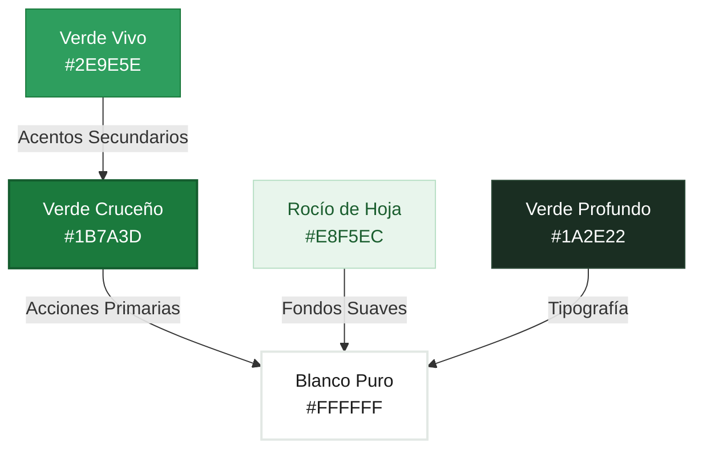
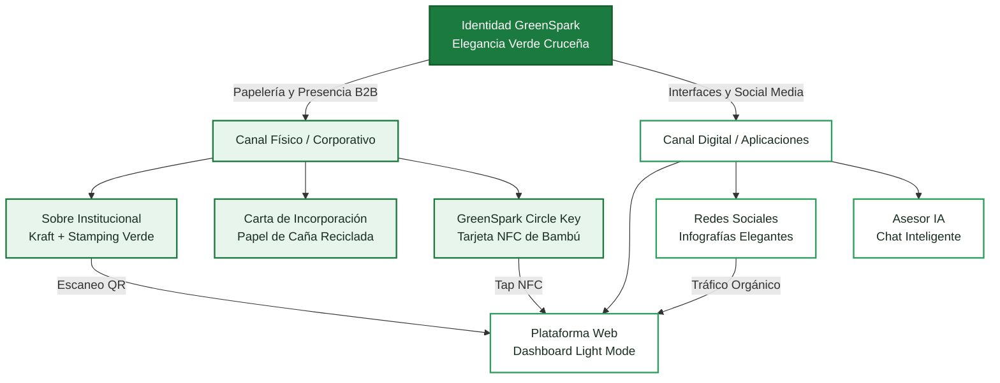

# Design System: GreenSpark 🌿✨

**Proyecto:** GreenSpark · **Mención:** ENERGÍA · **Equipo:** HackHeroes  
**Lugar:** Santa Cruz de la Sierra, Bolivia  
**Propósito:** Capa de Inteligencia Artificial para la Conversión de Residuos Orgánicos en Energía Rentable y Medible.

---

## 1. Visual Theme & Atmosphere: *"Elegancia Verde Cruceña"*

La identidad visual de **GreenSpark** se inspira directamente en la bandera de Santa Cruz de la Sierra — **verde, blanco, verde** — y en la luminosidad natural del oriente boliviano. No es una estética oscura ni agresivamente tecnológica; es **claridad, confianza y sofisticación**, como una brisa fresca que atraviesa los llanos cruceños al amanecer.

El mood general es **luminoso, sereno y refinado**:

*   **Claridad como Confianza:** Fondos blancos amplios y generosos que transmiten transparencia institucional. Un sistema que no tiene nada que ocultar se presenta con la luz encendida. El espacio en blanco no es vacío — es respiro, orden y profesionalismo.
*   **Verde Institucional Cruceño:** El verde de la bandera departamental (`#006600`) representa la riqueza vegetal y los bosques de la región. Lo elevamos a un verde más contemporáneo y suave que mantiene la dignidad del símbolo cívico sin perder frescura: un verde que evoca las copas de los árboles del Urubó bajo la luz del mediodía.
*   **Suavidad Elegante:** Cada elemento tiene bordes redondeados, transiciones delicadas y sombras apenas perceptibles. La interfaz se siente como tocar seda — todo fluye sin fricción. La tecnología de IA más avanzada, presentada con la calidez y cercanía del carácter cruceño.
*   **Texturas Bioluminiscentes & Glassmorphic Depths (Premium):** Introducimos capas de cristal translúcido (Glassmorphism) con desenfoque de fondo y bordes hiper-finos que flotan sobre halos suaves de luz verde y una sutil textura de grano orgánico en el fondo general, añadiendo una organicidad analógica espectacular y huyendo de los colores planos que gritan "hecho por IA".

> **Palabras clave de la atmósfera:** Luminoso · Glassmorphism · Grano Orgánico · Bioluminiscente · Premium · Orgullosamente Cruceño.

---

## 2. Color Palette & Roles

La paleta cromática nace de la tricolor cruceña — **verde, blanco, verde** — y se expande con tonalidades derivadas que mantienen la armonía visual. La sensación general es de frescura vegetal, limpieza institucional y sofisticación silenciosa.



### 2.1. Colores Primarios

| Token de Diseño | Color | Hex | HSL | Rol Funcional |
|---|---|---|---|---|
| **Verde Cruceño** | Verde bosque institucional, inspirado en la bandera departamental, modernizado con un toque más cálido y luminoso | `#1B7A3D` | 146°, 63%, 29% | Acciones primarias, botones CTA, encabezados de sección, iconografía activa, bordes de elementos seleccionados. Es el corazón de la identidad cruceña — dignidad y naturaleza. |
| **Blanco Puro** | Blanco absoluto, limpio como algodón fresco | `#FFFFFF` | 0°, 0%, 100% | Fondo principal de toda la interfaz, superficie de tarjetas, espacio de respiro. El lienzo donde todo respira y los datos se presentan con claridad total. |
| **Verde Profundo** | Verde oscuro casi negro, con la densidad de un bosque al anochecer | `#1A2E22` | 150°, 28%, 14% | Tipografía principal, títulos, textos de alta jerarquía. Reemplaza al negro puro para mantener la cohesión cromática verde-blanco sin la dureza del negro absoluto. |

### 2.2. Colores Secundarios y de Apoyo

| Token de Diseño | Color | Hex | HSL | Rol Funcional |
|---|---|---|---|---|
| **Rocío de Hoja** | Verde ultra-claro, como la condensación matutina sobre una hoja de motacú | `#E8F5EC` | 136°, 38%, 93% | Fondos de secciones alternas, fondos de tarjetas secundarias, áreas de contenido destacado, tooltips. Es la respiración verde del diseño — presente pero nunca invasivo. |
| **Verde Vivo** | Verde medio vibrante, fresco y energético | `#2E9E5E` | 148°, 55%, 40% | Estados hover de botones primarios, indicadores de éxito, badges de estado activo, progreso positivo. Complementa al Verde Cruceño con más luminosidad para interacciones. |
| **Niebla de Pradera** | Gris verdoso ultra-suave, apenas perceptible | `#F5F8F6` | 140°, 18%, 96% | Fondo general de la página web detrás de las tarjetas blancas. Da una profundidad sutil sin alejarse del blanco — como una neblina matutina sobre los campos del oriente. |
| **Borde Sereno** | Gris verdoso pálido, elegante y discreto | `#D4DDD7` | 140°, 12%, 85% | Bordes de tarjetas, separadores horizontales, líneas divisorias. Estructura la interfaz con la delicadeza de un trazo de lápiz — organiza sin competir. |
| **Texto Secundario** | Gris medio con un matiz verde, amable a la vista | `#5A7265` | 148°, 12%, 40% | Subtítulos, captions, textos descriptivos, labels de formularios. Textos que acompañan sin exigir atención — la voz baja y cálida del sistema. |
| **Alerta Ámbar Cálido** | Ámbar dorado suave, como la luz del atardecer cruceño | `#D4930A` | 41°, 91%, 44% | Alertas de precaución, advertencias del sistema, indicadores de datos que requieren atención sin urgencia crítica. |
| **Alerta Coral Suave** | Rojo-coral amable, sin agresividad | `#C94C4C` | 0°, 51%, 54% | Estados de error, alertas críticas, validaciones negativas. Comunica urgencia sin gritar. |

### 2.3. Gradientes del Sistema

| Nombre | Valores | Uso |
|---|---|---|
| **Amanecer Verde** | `linear-gradient(135deg, #1B7A3D, #2E9E5E)` | Fondos de botones CTA premium, banners hero, encabezados de secciones importantes — un degradado que evoca el paso del verde profundo del bosque a la frescura de las hojas nuevas. |
| **Brisa de Hoja** | `linear-gradient(180deg, #FFFFFF 0%, #F5F8F6 50%, #E8F5EC 100%)` | Transición de fondos de página completa — la mirada viaja del blanco puro a un susurro verde que sugiere naturaleza sin imponerse. |
| **Resplandor Suave** | `radial-gradient(circle, rgba(27,122,61,0.06), transparent 70%)` | Halo ambiental detrás de métricas importantes y KPIs — un resplandor verde casi imperceptible que da importancia visual sin artificio. |

---

## 3. Typography Rules

La tipografía comunica **claridad profesional** con **calidez humana**. Tres familias tipográficas trabajan en armonía para cubrir toda la jerarquía de información con elegancia.

### 3.1. Familias Tipográficas

| Jerarquía | Familia | Fuente | Justificación |
|---|---|---|---|
| **Títulos e Identidad** | `Outfit` | Google Fonts | Sans-serif geométrica con terminaciones limpias y curvas sutiles — proyecta modernidad y cercanía. Sus formas redondeadas humanizan la información técnica y resuenan con la suavidad general del sistema. |
| **Cuerpo de Texto** | `Inter` | Google Fonts | Diseñada para legibilidad extrema en pantallas digitales a cualquier tamaño. Cada glifo está optimizado para renderizado nítido, garantizando claridad en tablas de datos, descripciones y texto conversacional. |
| **Datos y Código** | `JetBrains Mono` | Google Fonts | Monoespaciada con ligaduras opcionales — acentúa la precisión numérica y técnica del proyecto. Diferencia visualmente los datos cuantitativos del texto narrativo. |

### 3.2. Escala Tipográfica

| Elemento | Familia | Peso | Tamaño | Tracking | Color | Uso |
|---|---|---|---|---|---|---|
| Título Hero (H1) | Outfit | ExtraBold (800) | 48–64px | -0.02em | Verde Profundo `#1A2E22` | Landing page, pantallas de presentación |
| Título de Sección (H2) | Outfit | Bold (700) | 28–36px | -0.01em | Verde Profundo `#1A2E22` | Encabezados de módulos del dashboard |
| Subtítulo (H3) | Outfit | SemiBold (600) | 20–24px | 0em | Verde Cruceño `#1B7A3D` | Subtítulos de tarjetas, nombres de métricas |
| Cuerpo | Inter | Regular (400) | 14–16px | 0em | Verde Profundo `#1A2E22` | Párrafos, descripciones, chat del asesor IA |
| Caption / Nota | Inter | Medium (500) | 12px | 0.02em | Texto Secundario `#5A7265` | Pies de dato, confiabilidad de predicciones IA |
| Dato numérico | JetBrains Mono | Medium (500) | 14–32px | 0em | Verde Cruceño `#1B7A3D` | kWh, coordenadas GPS, coeficientes de IA |

---

## 4. Component Stylings

Los componentes de GreenSpark siguen una filosofía de **claridad como lienzo + verde como señal funcional**. Cada elemento visual justifica su presencia con elegancia silenciosa.

### 4.1. Contenedores y Tarjetas (*Cards*)

*   **Forma:** Esquinas generosamente redondeadas (`border-radius: 16px`) — suavidad que invita a la interacción, como cantos rodados pulidos por el río Piraí.
*   **Fondo & Glassmorphism:** Capas translúcidas con desenfoque de fondo (`background: rgba(255, 255, 255, 0.75); backdrop-filter: blur(12px);`) para simular la condensación del rocío de hoja sobre cristal premium.
*   **Borde:** Línea ultra-fina de 1px en **Borde Sereno** con transparencia táctil (`border: 1px solid rgba(212, 221, 215, 0.6)`) — estructura con extrema delicadeza.
*   **Sombra & Halo Glow:** Sombra difuminada con matiz de hoja y halo bioluminiscente radial suave (`box-shadow: 0 4px 24px -2px rgba(26, 46, 34, 0.04), 0 0 16px 0 rgba(27, 122, 61, 0.02)`) — flotabilidad impecable. En estado hover, el halo se intensifica con un destello ecológico orgánico y se eleva: `box-shadow: 0 12px 36px -4px rgba(27, 122, 61, 0.08), 0 0 24px 0 rgba(27, 122, 61, 0.05); transform: translateY(-2px); transition: transform 0.3s cubic-bezier(0.16, 1, 0.3, 1), box-shadow 0.3s ease;`.
*   **Padding interno:** 24px en desktop, 16px en mobile — espacio generoso que permite a los datos respirar con total soltura.

### 4.2. Botones Primarios (CTA)

*   **Forma:** Esquinas suavemente redondeadas (`border-radius: 10px`) — moderno y acogedor.
*   **Fondo:** Gradiente **Amanecer Verde** (`linear-gradient(135deg, #1B7A3D, #2E9E5E)`) — profundidad elegante sin ser plano.
*   **Tipografía:** `Outfit SemiBold` en **Blanco Puro** (`#FFFFFF`) — legibilidad perfecta sobre verde.
*   **Comportamiento:** Transición fluida de 250ms (`ease-out`). Al hover, la sombra se expande suavemente: `box-shadow: 0 4px 16px rgba(27, 122, 61, 0.25)` y el botón se eleva 1px (`transform: translateY(-1px)`). El efecto comunica *"esta acción te lleva adelante"* — sin estridencia, con confianza.

### 4.3. Botones Secundarios

*   **Forma:** Esquinas suavemente redondeadas (`border-radius: 10px`) — consistencia con el primario.
*   **Fondo:** Transparente con borde de 1.5px en **Verde Cruceño** (`#1B7A3D`).
*   **Tipografía:** `Outfit SemiBold` en **Verde Cruceño** (`#1B7A3D`).
*   **Comportamiento:** Al hover, el fondo se llena con **Rocío de Hoja** (`#E8F5EC`) — un verde susurro que confirma la interacción con suavidad.

### 4.4. Botones Terciarios / Ghost

*   **Forma:** Sin fondo ni borde visible — solo texto.
*   **Tipografía:** `Inter Medium` en **Verde Cruceño** (`#1B7A3D`), subrayado sutil al hover.
*   **Comportamiento:** Al hover, el texto se oscurece a **Verde Profundo** (`#1A2E22`) con una transición de 200ms. Mínimo impacto visual, máxima funcionalidad.

### 4.5. Campos de Entrada (*Inputs / Forms*)

*   **Fondo:** **Blanco Puro** (`#FFFFFF`) con borde de 1.5px en **Borde Sereno** (`#D4DDD7`).
*   **Focus:** Al enfocar, el borde transiciona a **Verde Cruceño** (`#1B7A3D`) con un resplandor verde ultra-suave: `box-shadow: 0 0 0 3px rgba(27, 122, 61, 0.12)`. El campo se ilumina con elegancia, como una hoja que recibe la luz del sol.
*   **Texto de placeholder:** `Inter Regular` en **Texto Secundario** (`#5A7265`) con opacidad al 70% — indica sin competir.
*   **Esquinas:** Generosamente redondeadas (`border-radius: 10px`) — consistencia total con botones.
*   **Label:** `Inter Medium` 14px en **Verde Profundo** (`#1A2E22`), posicionado sobre el campo con 6px de separación.

### 4.6. Mapa de Rutas de Recolección (Google OR-Tools)

*   **Base cartográfica:** Mosaico claro y limpio (*Light Map Tile*) con calles en gris suave sobre fondo blanco verdoso — el mapa es legible y elegante, no oscuro ni dramático.
*   **Rutas optimizadas por IA:** Trazadas en **Verde Cruceño** (`#1B7A3D`) con un trazo de 3px y esquinas redondeadas — la ruta se integra naturalmente con la cartografía.
*   **Plantas receptoras de biogás:** Marcadas con pines circulares en **Verde Vivo** (`#2E9E5E`) con un anillo blanco exterior — limpios, claros, inequívocos.
*   **Generadores de residuo:** Pines circulares en **Texto Secundario** (`#5A7265`) con centro blanco — identificables sin competir con las plantas.
*   **Tooltip de mapa:** Tarjeta blanca con esquinas redondeadas y sombra suave, mostrando datos en `JetBrains Mono` verde.

### 4.7. Chat del Asesor de Sostenibilidad IA

*   **Burbujas del agente:** Fondo **Rocío de Hoja** (`#E8F5EC`) con esquinas generosamente redondeadas (16px, con esquina inferior izquierda en 4px), texto **Verde Profundo** (`#1A2E22`) en `Inter Regular`. Limpio, acogedor y distinguible.
*   **Burbujas del usuario:** Fondo gradiente **Amanecer Verde**, esquinas redondeadas (16px, con esquina inferior derecha en 4px), texto **Blanco Puro** en `Inter Regular`. El usuario siempre se identifica con el color institucional.
*   **Indicador "Agente pensando...":** Tres puntos pulsantes en **Verde Cruceño** con una animación suave de opacidad (fade in/out secuencial cada 400ms) — calma y confianza mientras el modelo procesa.
*   **Datos citados:** Aparecen en `JetBrains Mono` con fondo `rgba(27, 122, 61, 0.06)` y borde izquierdo de 3px en **Verde Cruceño** — diferenciación inmediata de datos cuantitativos vs. texto conversacional.

### 4.8. Badges y Estados

| Estado | Fondo | Texto | Borde | Uso |
|---|---|---|---|---|
| **Activo / Éxito** | `#E8F5EC` | `#1B7A3D` | ninguno | Procesos completados, datos validados |
| **En Proceso** | `#FFF8E7` | `#D4930A` | ninguno | Operaciones en curso, datos pendientes |
| **Error / Crítico** | `#FDE8E8` | `#C94C4C` | ninguno | Fallos, alertas urgentes |
| **Neutro / Info** | `#F0F2F1` | `#5A7265` | ninguno | Información contextual, metadata |

---

## 5. Depth & Elevation

La interfaz de GreenSpark maneja la profundidad con **sombras suaves y sutiles**, como la luz natural del oriente boliviano proyectando sombras delicadas bajo un cielo despejado. La elevación es silenciosa y funcional.

| Nivel | Técnica | Ejemplo de Uso |
|---|---|---|
| **Nivel 0 — Base** | Fondo **Niebla de Pradera** (`#F5F8F6`), sin sombra | Capa base de la página web completa |
| **Nivel 1 — Superficie** | Fondo **Blanco Puro** (`#FFFFFF`), sombra `0 1px 4px rgba(26,46,34,0.04)` | Tarjetas de contenido, paneles de datos |
| **Nivel 2 — Elevado** | Fondo **Blanco Puro**, sombra `0 2px 12px rgba(26,46,34,0.06)` | Tarjetas interactivas, contenedores principales |
| **Nivel 3 — Flotante** | Fondo **Blanco Puro**, sombra `0 8px 32px rgba(26,46,34,0.10)` | Dropdowns, tooltips expandidos, modales |
| **Nivel 4 — Overlay** | Fondo **Blanco Puro** con backdrop `rgba(26,46,34,0.20)` y blur de 8px | Diálogos de confirmación, overlays de carga |

> **Principio rector:** Las sombras son siempre difuminadas, suaves y con un leve matiz verde-gris (nunca negro puro). La elevación se comunica como capas de papel apiladas con delicadeza — como hojas de un cuaderno de campo, no como bloques de concreto.

---

## 6. Layout Principles

### 6.1. Espaciado y Retícula

*   **Sistema de spacing:** Escala de 4px (`4, 8, 12, 16, 24, 32, 48, 64, 96`). Todo margen, padding y gap entre elementos se alinea a este sistema — orden matemático con resultado visual orgánico.
*   **Retícula base:** Grid de 12 columnas con gutters de 24px para desktop, colapsando a 4 columnas con gutters de 16px en mobile.
*   **Márgenes de página:** 32px en desktop, 16px en mobile — respiro generoso que da importancia al contenido.
*   **Ancho máximo de contenido:** 1200px centrado — evita que el diseño se estire en pantallas ultrawide, manteniendo la legibilidad y la elegancia.

### 6.2. Principios de Composición

1.  **Blanco como Lienzo:** Todo nace del blanco. La claridad del fondo transmite transparencia institucional y confianza profesional. Las interfaces oscuras están reservadas exclusivamente para contextos de visualización de datos inmersiva (ej. un modo nocturno opcional del dashboard).
2.  **Verde Funcional, no Decorativo:** El uso del **Verde Cruceño** (`#1B7A3D`) debe estar justificado por la importancia de la acción o dato. Si todo es verde, nada es importante. El verde es un recurso escaso y valioso — como el agua en el Chaco.
3.  **Trazabilidad Científica:** Cada dato, porcentaje o predicción energética incluye un pie de confiabilidad (ej. *"Predicción IA con ±3% de desviación basada en humedad local"*). Construye confianza con socios e inversionistas.
4.  **Localismo Orgulloso:** Mapas y ejemplos usan nombres reales de Santa Cruz (Equipetrol, El Trompillo, Plan 3000, la Ramada, el Urubó). Demostramos un entendimiento íntimo del territorio.
5.  **Transparencia de la IA:** La visualización refleja la inteligencia artificial de forma honesta — sin falsificar funcionalidades ni exagerar capacidades, en línea con las reglas de la Hackathon.

---

## 7. Iconography & Illustrations

### 7.1. Estilo de Iconografía

*   **Trazo:** Iconos de trazo (*outline*) con peso de 1.5px — delgados, elegantes y legibles.
*   **Esquinas:** Redondeadas (`round caps`, `round joins`) — consistencia con la suavidad general del sistema.
*   **Color por defecto:** **Texto Secundario** (`#5A7265`). Cuando están activos o seleccionados: **Verde Cruceño** (`#1B7A3D`).
*   **Tamaño base:** 20px para interfaz general, 24px para navegación, 16px para elementos compactos.
*   **Fuente recomendada:** [Lucide Icons](https://lucide.dev/) o [Phosphor Icons](https://phosphoricons.com/) — ambas ofrecen un estilo limpio y consistente alineado con la estética del sistema.

### 7.2. Ilustraciones

*   **Estilo:** Flat con detalles sutiles de línea — evitar 3D realista o ilustraciones infantiles.
*   **Paleta:** Exclusivamente los verdes del sistema (`#1B7A3D`, `#2E9E5E`, `#E8F5EC`) sobre fondos blancos.
*   **Uso:** Empty states, onboarding, secciones de error — humanizar momentos donde no hay datos.

---

## 8. Corporate Identity & B2B Sales Kit: *"La Invitación Institucional"*

El proceso de incorporación de grandes generadores de residuos (universidades como la UCB, la UPSA o la UAGRM; corporaciones afiliadas a CAINCO y FEGASACRUZ) requiere una presencia física tan refinada como el software mismo. La papelería institucional es el primer puente tangible del impacto digital de GreenSpark.

### 8.1. El Sobre de Presentación

*   **Exterior:** Papel kraft reciclado de fibra de caña de azúcar (insumo icónico de la agroindustria cruceña), prensado de alta densidad, en su color natural cálido. En el centro, el logotipo de GreenSpark en estampado metálico caliente (*hot stamping*) en **Verde Cruceño**. El diseño es minimalista extremo — solo el logo y un patrón geométrico sutil de hojas estilizadas que se desvanece en los bordes.
*   **Cierre:** Sello circular con un código QR funcional y la leyenda: *"Escaneá para medir el impacto latente de tus residuos antes de abrir"*. El QR dirige a una landing page personalizada.
*   **Interior:** Revestimiento en **Blanco Puro** con una franja verde sutil en la parte superior, y la siguiente frase en tipografía `Outfit SemiBold` centrada:

    > *"Estás abriendo la puerta a la soberanía energética de Santa Cruz de la Sierra."*

### 8.2. La Carta de Incorporación Institucional

*   **Material:** Impresa en papel ecológico certificado elaborado con residuo agroindustrial cruceño. Textura orgánica táctil de alta calidad.
*   **Encabezado:** Logo GreenSpark alineado a la izquierda en **Verde Cruceño**. A la derecha, en tipografía monoespaciada (`JetBrains Mono`) gris: `RED-SPARK // SOCIO-INNOVADOR // UCB-SCZ-2026`.
*   **Destinatario:** *A las Autoridades Académicas / Directores de Sostenibilidad* (personalizado por institución).
*   **Cuerpo de la carta:**

    > *"Nos complace certificar que su institución ha sido seleccionada para formar parte de la Red de Innovación Energética de Alto Nivel de GreenSpark.*
    >
    > *A partir de hoy, los residuos generados en sus comedores y áreas comunes ya no serán catalogados como basura o costos logísticos de desecho.*
    >
    > *Mediante nuestro sistema de Inteligencia Artificial predictivo, hemos identificado que los residuos orgánicos diarios de su campus tienen el potencial de iluminar aulas y laboratorios mediante un flujo de energía descentralizada y limpia, retornando además abono de alta calidad para el suelo de nuestro departamento.*
    >
    > *Ustedes ya no son solo un centro educativo; son una celda energética activa de la Santa Cruz del mañana."*

### 8.3. La GreenSpark Circle Key (Token de Acceso Físico)

Incrustada en un troquel central de la carta, la **GreenSpark Circle Key** es una tarjeta inteligente premium de bambú claro con chip NFC integrado y acabado mate. Al acercar el celular, se abre instantáneamente el portal dinámico de GreenSpark.

*   **Material:** Bambú claro prensado, grabado láser en **Verde Cruceño** con el logo y un código QR de respaldo.
*   **Dimensiones:** Formato tarjeta de crédito (85.6 × 53.98 mm).
*   **Tecnología:** Chip NFC NTAG215 — compatible con iOS y Android sin app adicional.
*   **Experiencia:** El receptor pasa de sostener un objeto físico premium a visualizar su impacto energético digital en segundos.

---

## 9. Social Media Identity & Marketing: *"Cercanía Institucional"*

La estrategia en plataformas digitales equilibra la rigurosidad de la IA con la calidez del cruceño, humanizando datos complejos mediante analogías cotidianas y visuales elegantes.

### 9.1. Identidad Visual en Redes

*   **Grillas de Contenido:** Diseños limpios con uso intensivo de espacio en blanco. Los marcos emplean acentos sutiles en **Verde Cruceño** que organizan la información con precisión.
*   **Tipografía en Imágenes:** Títulos en `Outfit ExtraBold` en **Verde Profundo** con palabras clave resaltadas en **Verde Cruceño**. Fondos predominantemente blancos o **Rocío de Hoja** para mantener la elegancia.
*   **Imágenes de Calidad:** Fotografías del paisaje cruceño (el verde del Urubó, campus universitarios, la vida urbana) editadas con alta luminosidad y contraste suave, integrando infografías limpias superpuestas con la paleta verde-blanco.
*   **Paleta en Redes:** Fondos predominantemente claros (blanco o Rocío de Hoja). El **Verde Cruceño** es el único color de acento principal — jamás se diluye la identidad con colores ajenos a la paleta.

### 9.2. Formatos por Plataforma

| Plataforma | Formato Estrella | Tono de Voz | Frecuencia |
|---|---|---|---|
| **Instagram** | Carruseles de datos humanizados + Reels de "Detrás del Algoritmo" | Cercano, visual, con datos locales | 4–5 posts / semana |
| **LinkedIn** | Artículos técnicos + casos de éxito institucional | Profesional pero accesible, orientado a decisores | 2–3 posts / semana |
| **TikTok** | Reels educativos de 30–60s sobre IA y residuos | Informal, relajado, sin jerga excesiva | 3–4 videos / semana |

### 9.3. Tácticas de Contenido y Conexión Emocional

#### Táctica 1: La Humanización del kWh — *"¿Qué significa este dato para mí?"*

*   **Slide 1:** *"¿Qué tienen en común tu almuerzo en Equipetrol y cargar tu celular por un año?"* — Fondo blanco, fotografía premium con acento verde.
*   **Slide 2:** *"Ayer, la zona de Equipetrol desechó 500 kg de residuos orgánicos. Nuestra IA predijo que equivalen a 100 kWh de energía."* — Gráfica limpia con datos en Verde Cruceño.
*   **Slide 3:** *"Esa energía es suficiente para cargar 8.300 smartphones de 0% a 100%."* — Ilustración flat elegante.
*   **Slide 4:** *"El futuro no se bota, se transforma. Únete a la red."* — Botón CTA con gradiente Amanecer Verde.

#### Táctica 2: El Tablero de Honor Universitario — *#RedGreenSpark*

Publicaciones dedicadas a celebrar la integración de universidades locales con un diseño limpio, profesional y orgulloso.

#### Táctica 3: Detrás del Algoritmo — *"Build in Public"*

Videos cortos mostrando desarrollo real con la estética clara de GreenSpark.

---

## 10. Brand Ecosystem & Communication Channels



---

## 11. Design Principles for New Views

Cuando se diseñen nuevas pantallas, componentes o materiales para GreenSpark, el equipo debe seguir estos **cinco principios irrenunciables**:

| # | Principio | Regla |
|---|---|---|
| 1 | **Blanco como Lienzo** | Todo nace del blanco puro y la Niebla de Pradera. La claridad transmite confianza, transparencia y profesionalismo. El fondo limpio es el escenario donde los datos se presentan con dignidad. |
| 2 | **Verde Funcional, no Decorativo** | El Verde Cruceño (`#1B7A3D`) solo se usa para acciones importantes o datos críticos. Si todo es verde, nada comunica importancia. Cada uso de verde debe ser intencional. |
| 3 | **Trazabilidad Científica** | Cada predicción incluye un indicador de confiabilidad del modelo. Esto construye la confianza de socios e inversionistas. |
| 4 | **Localismo Orgulloso** | Mapas, ejemplos y analogías usan ubicaciones reales de Santa Cruz (Equipetrol, Plan 3000, el Urubó). Demostramos conocimiento íntimo del territorio. |
| 5 | **Transparencia de la IA** | La visualización refleja la IA de forma honesta, sin falsificar funcionalidades ni exagerar capacidades. |

---

## 12. CSS Variables Reference

Para implementación directa, estas son las variables CSS del sistema:

```css
:root {
  /* === Colores Primarios === */
  --color-primary: #1B7A3D;           /* Verde Cruceño */
  --color-primary-hover: #2E9E5E;     /* Verde Vivo */
  --color-primary-dark: #145C2E;      /* Verde Cruceño oscurecido */
  --color-background: #FFFFFF;         /* Blanco Puro */
  --color-text-primary: #1A2E22;       /* Verde Profundo */
  
  /* === Colores Secundarios === */
  --color-surface: #FFFFFF;            /* Superficie de tarjetas */
  --color-surface-alt: #E8F5EC;        /* Rocío de Hoja */
  --color-page-bg: #F5F8F6;           /* Niebla de Pradera */
  --color-border: #D4DDD7;            /* Borde Sereno */
  --color-text-secondary: #5A7265;     /* Texto Secundario */
  
  /* === Alertas === */
  --color-warning: #D4930A;            /* Ámbar Cálido */
  --color-error: #C94C4C;             /* Coral Suave */
  --color-success: #1B7A3D;           /* Verde Cruceño (reúso) */
  
  /* === Gradientes === */
  --gradient-primary: linear-gradient(135deg, #1B7A3D, #2E9E5E);
  --gradient-page: linear-gradient(180deg, #FFFFFF 0%, #F5F8F6 50%, #E8F5EC 100%);
  
  /* === Sombras === */
  --shadow-sm: 0 1px 4px rgba(26, 46, 34, 0.04);
  --shadow-md: 0 2px 12px rgba(26, 46, 34, 0.06);
  --shadow-lg: 0 8px 32px rgba(26, 46, 34, 0.10);
  --shadow-hover: 0 4px 20px rgba(27, 122, 61, 0.10);
  
  /* === Bordes === */
  --radius-sm: 8px;
  --radius-md: 10px;
  --radius-lg: 16px;
  --radius-full: 9999px;
  
  /* === Tipografía === */
  --font-display: 'Outfit', sans-serif;
  --font-body: 'Inter', sans-serif;
  --font-mono: 'JetBrains Mono', monospace;
  
  /* === Espaciado (base 4px) === */
  --space-1: 4px;
  --space-2: 8px;
  --space-3: 12px;
  --space-4: 16px;
  --space-6: 24px;
  --space-8: 32px;
  --space-12: 48px;
  --space-16: 64px;
  --space-24: 96px;
  
  /* === Transiciones === */
  --transition-fast: 150ms ease-out;
  --transition-base: 250ms ease-out;
  --transition-slow: 400ms ease-out;
}
```

---

> **Nota final:** Este documento es la fuente de verdad (*source of truth*) para toda decisión de diseño visual de GreenSpark. Cualquier nueva pantalla, publicación en redes, pieza de papelería o material de presentación debe alinearse con los tokens de color, la tipografía, los principios de composición y la atmósfera definidos aquí. La identidad cruceña — verde, blanco, verde — es el ADN visual inquebrantable del proyecto.
