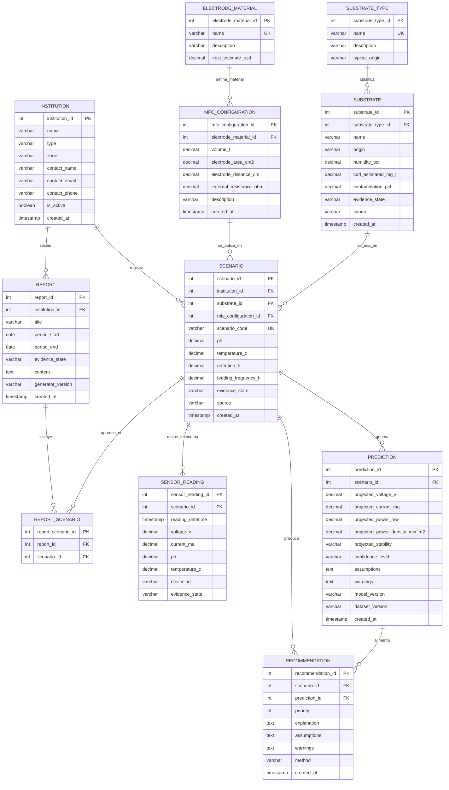

# Entity Relationship Diagram (ERD)

Este documento contiene un **ERD compacto** para GreenSpark, construido
desde los procesos documentados: instituciones, sustratos, configuraciones MFC,
escenarios de simulacion, predicciones, recomendaciones de experimentos,
reportes institucionales y telemetria futura.

El objetivo no es meter todas las tablas posibles. El objetivo es modelar el
nucleo del sistema investigativo sin duplicar informacion y dejando relaciones
claras.

Para estudiar la logica operativa que justifica estas tablas, revisar tambien:
[Arquitectura tecnologica](../entregables_obligatorios/markdown/07%20arquitectura%20tecnologica.md) y
[Aplicacion de IA](../entregables_obligatorios/markdown/06%20aplicacion%20de%20ia.md).

## Diagrama base

## Decisiones de diseno

- `INSTITUTION` identifica al actor que investiga o pilota (universidad,
  colegio, restaurante, agroindustria). El campo `type` distingue la categoria
  sin necesidad de tablas separadas por rol.
- `SUBSTRATE` separa la muestra concreta del `SUBSTRATE_TYPE` (categoria
  general como `residuo_alimentario`, `residuo_agroindustrial`, etc.). Asi
  se pueden registrar multiples lotes del mismo tipo con condiciones distintas.
- `ELECTRODE_MATERIAL` normaliza materiales de electrodo (carbon, grafito,
  acero inoxidable, etc.) para evitar texto libre y facilitar comparaciones.
- `MFC_CONFIGURATION` describe el reactor evaluado. Cada escenario referencia
  una configuracion concreta para mantener trazabilidad.
- `SCENARIO` es la tabla central. Combina institucion, sustrato, configuracion
  y condiciones operativas. El campo `evidence_state` distingue `SIMULADO`,
  `MEDIDO` y `META_EXPLORATORIA` segun la documentacion del proyecto.
- `PREDICTION` guarda resultados proyectados con `model_version` y
  `dataset_version`. NO dependas de una unica prediccion: el modelo cambia
  y cada version debe ser trazable.
- `RECOMMENDATION` guarda la priorizacion de experimentos. Referencia tanto
  al escenario como a la prediccion que la alimento, permitiendo auditar
  por que se recomendo un experimento.
- `SENSOR_READING` pertenece a la **fase 2** (piloto fisico). Registra
  telemetria del reactor instrumentado vinculada al escenario correspondiente.
- `REPORT` genera resumenes institucionales trazables. La tabla intermedia
  `REPORT_SCENARIO` permite que un reporte incluya multiples escenarios
  y que un escenario aparezca en multiples reportes.
- `evidence_state` aparece en `SUBSTRATE`, `SCENARIO`, `SENSOR_READING` y
  `REPORT` para cumplir el principio de honestidad tecnica del proyecto:
  nunca mezclar simulacion con medicion sin etiqueta.

## Alcance no incluido en este ERD compacto

Para mantener el modelo corto, quedan fuera del diagrama principal:

- usuarios, roles y permisos (necesarios al pasar de prototipo a piloto)
- historial de versiones de modelos y datasets (se puede extender con una
  tabla `MODEL_VERSION` cuando se implemente el pipeline de ML)
- detalle de anomalias detectadas por el sistema (fase 2)
- configuracion del gateway de IA y logs de llamadas al LLM
- movimientos historicos de sustratos (recoleccion, transporte, recepcion)
- evaluacion de biodigestores (fase 3, cuando exista volumen suficiente)
- subproductos y su caracterizacion agronomica
- facturacion, convenios y documentos contractuales con instituciones
