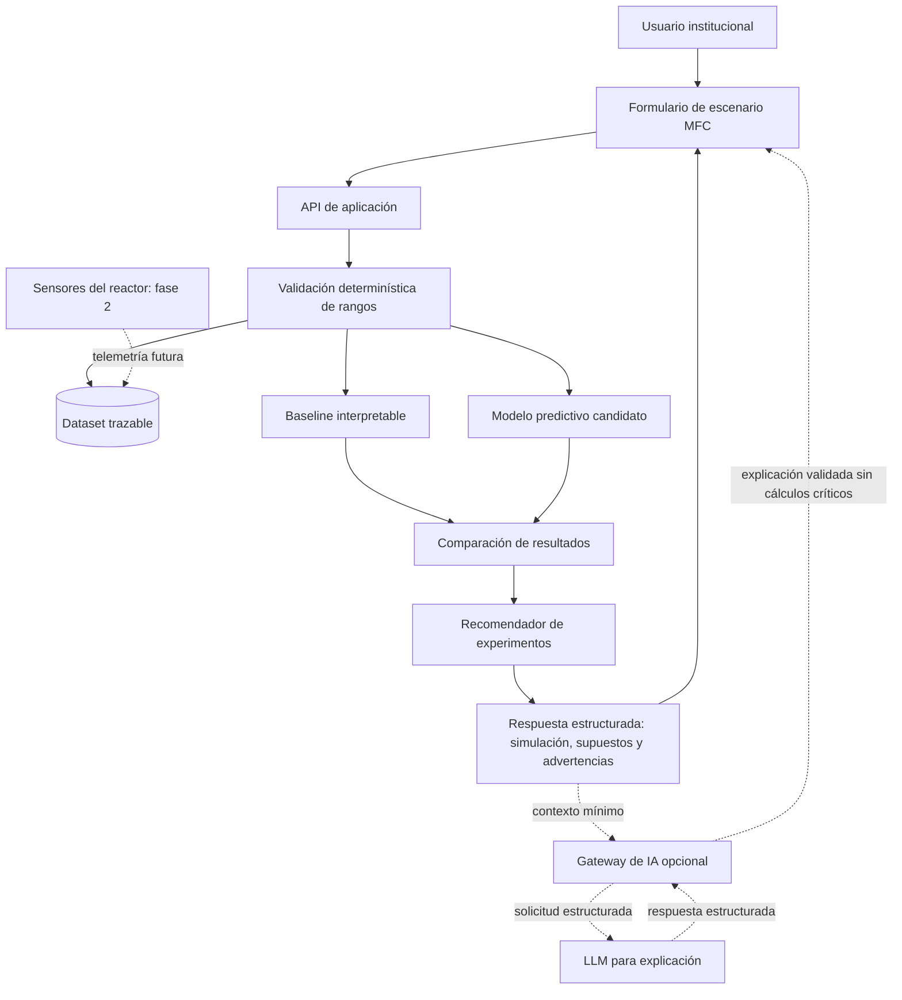

# GreenSpark: Aplicación de IA

**Equipo:** HackHeroes · **Mención:** Energía · **Lugar:** Santa Cruz de la Sierra, Bolivia
**Fecha:** 31 de mayo de 2026 · **Versión:** 1.0

> **Principio técnico:** la IA de GreenSpark debe mejorar una decisión experimental. No reemplaza mediciones, no inventa resultados y no convierte una simulación en evidencia física.

## 1. Resumen ejecutivo

GreenSpark propone investigar cómo aprovechar residuos bioorgánicos de Santa Cruz de la Sierra mediante reactores de celdas de combustible microbianas (MFC). La decisión inicial no es instalar infraestructura a ciegas, sino determinar qué combinación de sustrato, operación y configuración del reactor conviene validar primero.

La IA se plantea como una capa de apoyo para comparar escenarios, estimar rendimiento eléctrico proyectado y priorizar experimentos. Las reglas determinísticas conservan el control de rangos físicos, cálculos críticos y etiquetado de evidencia. En una fase posterior, la telemetría de reactores físicos permitirá evaluar predicciones, detectar anomalías y mejorar el modelo con datos locales.

> **Estado actual:** este repositorio documenta el diseño conceptual. No contiene un modelo entrenado, una aplicación ejecutable ni mediciones generadas por un reactor físico construido por el equipo.

## 2. Pregunta que resuelve la IA

> ¿Qué configuración de reactor MFC y qué mezcla de sustrato conviene validar primero para maximizar un rendimiento eléctrico estable bajo condiciones definidas?

Cada experimento exige recursos, tiempo y control de variables. El número de combinaciones crece al variar tipo de residuo, humedad, pH, temperatura, tiempo de retención, área de electrodo, material, separación entre electrodos y resistencia externa. La IA busca reducir ese espacio de búsqueda antes de construir y operar múltiples prototipos físicos.

## 3. Por qué IA y no solo reglas fijas

Las reglas siguen siendo necesarias, pero no resuelven por sí solas la relación no lineal entre variables ni permiten aprender de nuevos experimentos.

| Enfoque | Ventaja | Limitación | Decisión |
| --- | --- | --- | --- |
| **Hoja de cálculo y reglas fijas** | Transparente, rápida y económica. | Valida límites, pero no aprende interacciones complejas entre variables. | Se conserva como baseline y capa de control. |
| **Búsqueda manual en literatura** | Aporta fundamento científico. | No prioriza automáticamente escenarios locales ni incorpora telemetría futura. | Se usa para construir el dataset inicial. |
| **Modelo supervisado** | Puede comparar relaciones entre variables y mejorar con datos locales. | Requiere dataset trazable y evaluación frente al baseline. | Estrategia propuesta para predicción. |
| **LLM por API** | Traduce resultados técnicos a lenguaje comprensible. | Puede alucinar y no debe calcular cifras críticas. | Componente opcional para explicación y reportes. |

La IA no se justifica por novedad. Se justifica si demuestra una mejora medible frente a una regla simple al priorizar experimentos.

## 4. Alcance por fase

| Etapa | Capacidad | Estado |
| --- | --- | --- |
| **Hackathon** | Diseño del pipeline, variables, contratos, métricas y escenarios de simulación. | **[ESTADO ACTUAL: DOCUMENTADO]** |
| **MVP investigativo** | Ejecutar baseline, comparar modelos y ordenar escenarios simulados o extraídos de literatura. | **[PROPUESTO]** |
| **Piloto MFC** | Incorporar mediciones locales y detectar anomalías operativas. | **[FASE 2]** |
| **Escalamiento** | Reentrenar con evidencia acumulada y evaluar modelos especializados. | **[FASE 3]** |

## 5. Componente predictivo de escenarios MFC

### 5.1 Entradas

| Grupo | Variables |
| --- | --- |
| **Sustrato** | `tipo_residuo`, `masa_kg`, `humedad_pct`, `cod_estimado_mg_l`, `contaminacion_pct` |
| **Operación** | `ph`, `temperatura_c`, `retencion_h`, `frecuencia_alimentacion_h` |
| **Reactor** | `volumen_l`, `area_electrodo_cm2`, `material_electrodo`, `distancia_electrodos_cm`, `resistencia_externa_ohm` |
| **Trazabilidad** | `origen_dato`, `estado_dato`, `fuente`, `fecha_registro` |

### 5.2 Salidas

- `voltaje_proyectado_v`
- `corriente_proyectada_ma`
- `potencia_proyectada_mw`
- `densidad_potencia_proyectada_mw_m2`
- `estabilidad_proyectada`
- `nivel_confianza`
- `supuestos`
- `advertencias`
- `version_modelo`

Todas las salidas predictivas deben mostrarse como **[SIMULACIÓN]** hasta contrastarlas con mediciones locales.

### 5.3 Estrategia de modelos

La estrategia propuesta es **baseline primero, complejidad después**:

1. Implementar una regresión lineal como baseline interpretable.
2. Comparar Random Forest y Gradient Boosting mediante `scikit-learn`.
3. Evaluar MAE, RMSE y R² con validación cruzada cuando el volumen de datos lo permita.
4. Seleccionar un modelo más complejo solo si reduce el error frente al baseline de forma consistente.
5. Documentar versión del dataset, variables, parámetros y métricas antes de usar una predicción en la toma de decisiones.

Los datos sintéticos sirven para demostrar el flujo, pero no bastan para afirmar precisión predictiva real.

## 6. Recomendador de experimentos

El recomendador propuesto ordena escenarios para decidir qué prueba física conviene ejecutar primero. Combina resultados del modelo con criterios explícitos:

1. potencia proyectada;
2. estabilidad esperada;
3. disponibilidad local del sustrato;
4. costo y complejidad experimental;
5. incertidumbre del modelo;
6. calidad y origen de los datos.

La primera versión puede usar una ponderación determinística y auditable. El valor del modelo predictivo consiste en enriquecer esa priorización, no en ocultar la lógica de decisión.

La salida no es una orden automática. Es una lista razonada para que el equipo universitario seleccione el siguiente experimento.

## 7. Detección de anomalías

Esta capacidad pertenece a la **[FASE 2]**, cuando exista un reactor instrumentado. El sistema podrá:

- comparar potencia observada y proyectada;
- detectar caídas abruptas de voltaje;
- alertar sobre desviaciones de pH o temperatura;
- identificar pérdida de estabilidad;
- sugerir revisar alimentación, conexión o condiciones del reactor.

No corresponde presentar detección de anomalías como una capacidad operativa durante la hackathon.

## 8. Agente explicativo opcional

Un LLM por API puede convertir resultados estructurados en una explicación comprensible para instituciones y usuarios no especializados:

- explicar por qué un escenario fue priorizado;
- diferenciar datos publicados, simulaciones, mediciones y metas exploratorias;
- responder preguntas sobre los supuestos visibles;
- preparar un reporte institucional de sostenibilidad.

### 8.1 Selección del proveedor

GreenSpark no declara un proveedor ni un modelo LLM implementado durante la hackathon. Antes de integrar uno, se debe registrar el modelo exacto y compararlo en estos ejes:

| Criterio | Pregunta de selección |
| --- | --- |
| **Salida estructurada** | ¿Respeta de forma consistente el esquema JSON solicitado? |
| **Latencia** | ¿Responde en un tiempo aceptable para la experiencia institucional? |
| **Costo** | ¿El costo por reporte es sostenible para el volumen esperado? |
| **Idioma** | ¿Explica con claridad en español y evita tecnicismos innecesarios? |
| **Seguridad** | ¿Permite enviar únicamente el contexto mínimo necesario? |

### 8.2 Regla anti-alucinación

El agente recibe resultados calculados y etiquetados por el backend. No inventa potencia, ahorro, emisiones ni porcentajes. Si falta un dato, debe declararlo.

## 9. Flujo de datos propuesto



## 10. Contratos estructurados

### 10.1 Ejemplo de entrada

```json
{
  "scenario_id": "mfc-scz-001",
  "estado_dato": "SIMULADO",
  "sustrato": {
    "tipo_residuo": "residuo_alimentario",
    "masa_kg": 5,
    "humedad_pct": 72,
    "cod_estimado_mg_l": null,
    "contaminacion_pct": 0
  },
  "operacion": {
    "ph": 7,
    "temperatura_c": 28,
    "retencion_h": 48
  },
  "reactor": {
    "volumen_l": 10,
    "area_electrodo_cm2": 120,
    "material_electrodo": "carbon",
    "distancia_electrodos_cm": 4,
    "resistencia_externa_ohm": 1000
  }
}
```

### 10.2 Ejemplo de salida

```json
{
  "scenario_id": "mfc-scz-001",
  "estado_resultado": "SIMULACION",
  "prediction": {
    "potencia_proyectada_mw": null,
    "estabilidad_proyectada": "PENDIENTE_DE_MODELO",
    "nivel_confianza": "NO_EVALUADO"
  },
  "recommendation": {
    "priority": "PENDIENTE_DE_EVALUACION",
    "reason": "El escenario debe pasar por baseline y modelo validado antes de priorizarse."
  },
  "missing_data": [
    "cod_estimado_mg_l"
  ],
  "warnings": [
    "No interpretar una simulación como medición física."
  ]
}
```

El ejemplo evita inventar resultados numéricos antes de disponer de un modelo evaluado.

## 11. Guardrails y validación

| Control | Propósito |
| --- | --- |
| **Validación de rangos físicos** | Rechazar pH, temperatura, dimensiones o resistencias fuera de límites definidos. |
| **Esquema estructurado** | Evitar respuestas libres difíciles de validar y renderizar. |
| **Etiquetado obligatorio** | Diferenciar `SIMULADO`, `MEDIDO` y `META_EXPLORATORIA`. |
| **Trazabilidad** | Registrar fuente, fecha, versión del dataset y versión del modelo. |
| **Cálculos fuera del LLM** | Mantener potencia, ahorro y métricas críticas bajo control determinístico. |
| **Datos faltantes** | Devolver `missing_data` y reducir confianza cuando falten variables relevantes. |
| **Fallback** | Mostrar resultados determinísticos y un mensaje controlado si falla el modelo o la API externa. |
| **Control humano** | Presentar recomendaciones como apoyo; la institución decide qué experimento ejecutar. |

## 12. Plan de evaluación

No se reportan métricas medidas durante la hackathon porque todavía no existe una ejecución documentada del modelo. La evaluación propuesta debe registrar:

| Dimensión | Métrica o prueba | Criterio de decisión |
| --- | --- | --- |
| **Predicción** | MAE, RMSE y R² | Comparar cada candidato frente al baseline. |
| **Generalización** | Validación cruzada | Evitar seleccionar un modelo por un único subconjunto favorable. |
| **Calidad de datos** | Porcentaje de registros completos y trazables | Identificar si faltan variables críticas. |
| **Utilidad** | Comparación de priorización con criterio experto | Verificar si la recomendación ayuda a elegir experimentos. |
| **Robustez** | Casos incompletos, extremos y ambiguos | Confirmar advertencias y rechazo de entradas inválidas. |
| **LLM opcional** | JSON válido, claridad, latencia y costo por reporte | Elegir proveedor únicamente después de medir. |

Casos mínimos de prueba:

1. escenario válido con variables completas;
2. escenario con datos faltantes;
3. escenario con valores físicamente inválidos;
4. comparación de dos configuraciones;
5. fallo del modelo o de la API externa;
6. telemetría anómala simulada para preparar la fase 2.

## 13. Riesgos, límites y mitigaciones

| Riesgo | Impacto | Mitigación |
| --- | --- | --- |
| **Dataset inicial pequeño** | Predicción poco confiable. | Baseline interpretable, validación cruzada y reentrenamiento con datos locales. |
| **Datos sintéticos confundidos con evidencia** | Sobrepromesa técnica. | Etiquetas visibles y separación estricta entre simulación y medición. |
| **Alucinación del LLM** | Reporte incorrecto. | Contexto mínimo, esquema estructurado, cálculos fuera del LLM y fallback. |
| **Sesgo por literatura no local** | Priorización débil para Santa Cruz. | Registrar fuentes y sustituir supuestos con telemetría del piloto. |
| **Dependencia de API externa** | Fallo o latencia durante una demo futura. | Componente opcional, timeout y respuesta controlada sin LLM. |
| **Sobreconfianza del usuario** | Decisiones prematuras. | Mostrar incertidumbre y mantener control humano. |

## 14. Evidencia que debe mostrar una demo futura

1. Un escenario MFC etiquetado como **[SIMULADO]**.
2. Variables editables y supuestos visibles.
3. Rechazo de una entrada inválida.
4. Comparación entre dos configuraciones.
5. Recomendación trazable del siguiente experimento.
6. Diferenciación explícita entre proyección, medición y meta.
7. Fallback visible si el agente explicativo no está disponible.

## 15. Conclusión

La aplicación de IA de GreenSpark se diseña bajo una premisa verificable: **la IA debe reducir el costo de aprender antes de escalar**. El baseline, las reglas físicas y la trazabilidad mantienen control sobre el sistema; los modelos predictivos buscan priorizar experimentos; y el LLM opcional explica resultados sin convertirse en fuente de verdad.
