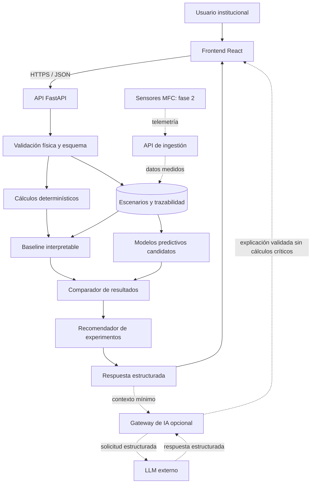
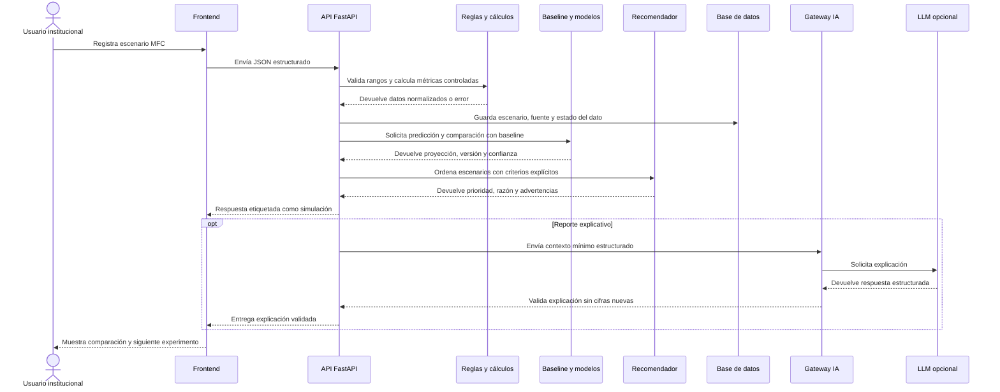

# GreenSpark: Arquitectura tecnológica

**Equipo:** HackHeroes · **Mención:** Energía · **Lugar:** Santa Cruz de la Sierra, Bolivia
**Fecha:** 31 de mayo de 2026 · **Versión:** 1.0
**Stack principal propuesto:** React · Python · FastAPI · SQLite/PostgreSQL · pandas · scikit-learn · LLM opcional por API

> **Estado:** arquitectura propuesta para un simulador investigativo y su evolución hacia pilotos MFC instrumentados. Este repositorio documenta el diseño conceptual; no contiene una aplicación ejecutable ni afirma que todos los componentes estén implementados durante la hackathon.

## 1. Resumen ejecutivo técnico

GreenSpark plantea una arquitectura modular para investigar cómo residuos bioorgánicos de Santa Cruz de la Sierra podrían aprovecharse en reactores de celdas de combustible microbianas (MFC). El sistema propuesto recibe variables del sustrato, la operación y el reactor; valida rangos físicos; compara escenarios mediante un baseline y modelos predictivos candidatos; y ordena experimentos para reducir el costo de aprender antes de construir pilotos.

La arquitectura separa lógica determinística, predicción y explicación. Los cálculos críticos y las etiquetas de evidencia permanecen bajo control del backend. Un LLM opcional puede explicar resultados estructurados, pero no genera cifras. La fase inicial usa literatura y escenarios simulados; la fase 2 incorpora sensores y mediciones locales.

## 2. Objetivo de la arquitectura

Diseñar una arquitectura que permita:

1. registrar y comparar escenarios MFC trazables;
2. procesar reglas físicas y cálculos críticos de forma determinística;
3. evaluar si un modelo predictivo mejora la priorización frente a un baseline;
4. explicar resultados sin ocultar incertidumbre;
5. distinguir simulaciones, mediciones y metas exploratorias;
6. evolucionar desde diseño conceptual hacia pilotos instrumentados.

## 3. Alcance por fase

| Etapa | Alcance | Estado |
| --- | --- | --- |
| **Hackathon** | Investigación, diseño de arquitectura, contratos y escenarios de simulación. | **[ESTADO ACTUAL: DOCUMENTADO]** |
| **MVP investigativo** | Interfaz, API, baseline, comparación de modelos, recomendador y persistencia local. | **[PROPUESTO]** |
| **Piloto MFC** | Captura de sensores, anomalías y dataset local versionado. | **[FASE 2]** |
| **Escalamiento** | PostgreSQL, monitoreo, autenticación, auditoría y evaluación de tecnologías de mayor capacidad. | **[FASE 3]** |

## 4. Requisitos técnicos

### 4.1 Requisitos funcionales

| Código | Requisito | Descripción |
| --- | --- | --- |
| **RF-01** | Registro de escenarios | El usuario registra sustrato, operación y configuración MFC. |
| **RF-02** | Validación determinística | El backend rechaza variables fuera de límites físicos definidos. |
| **RF-03** | Comparación de escenarios | El sistema compara baseline y modelos candidatos con trazabilidad. |
| **RF-04** | Recomendación experimental | El sistema ordena escenarios y explica qué experimento validar primero. |
| **RF-05** | Etiquetado de evidencia | Cada resultado distingue `SIMULADO`, `MEDIDO` y `META_EXPLORATORIA`. |
| **RF-06** | Reporte institucional | El sistema genera un resumen con supuestos, advertencias y métricas disponibles. |
| **RF-07** | Telemetría futura | La fase 2 ingiere voltaje, corriente, pH y temperatura desde sensores. |

### 4.2 Requisitos no funcionales

| Código | Requisito | Decisión arquitectónica |
| --- | --- | --- |
| **RNF-01** | Honestidad técnica | Separar proyección, medición y meta en datos e interfaz. |
| **RNF-02** | Modularidad | Desacoplar interfaz, API, reglas, modelos, recomendador y agente opcional. |
| **RNF-03** | Trazabilidad | Registrar fuente, fecha, versión del dataset y versión del modelo. |
| **RNF-04** | Seguridad | Mantener credenciales y llamadas externas únicamente en backend. |
| **RNF-05** | Explicabilidad | Mostrar supuestos, advertencias y motivos de priorización. |
| **RNF-06** | Resiliencia | Conservar respuesta determinística si falla el modelo o el LLM opcional. |
| **RNF-07** | Evolución gradual | Permitir sustituir escenarios simulados por telemetría local. |

## 5. Arquitectura general propuesta



## 6. Flujo principal de datos



## 7. Responsabilidad de cada componente

| Componente | Responsabilidad | No debe hacer |
| --- | --- | --- |
| **Frontend** | Capturar variables, mostrar etiquetas y comparar escenarios. | Exponer API keys o presentar simulación como medición. |
| **API de aplicación** | Orquestar validación, persistencia, modelos y respuesta. | Delegar decisiones críticas a texto libre. |
| **Reglas y cálculos** | Validar rangos físicos y calcular métricas controladas. | Fingir que una regla sustituye evidencia experimental. |
| **Baseline** | Ofrecer una referencia interpretable. | Ser omitido al evaluar modelos complejos. |
| **Modelos candidatos** | Estimar resultados proyectados y comparar desempeño. | Afirmar precisión sin métricas documentadas. |
| **Recomendador** | Ordenar experimentos con criterios visibles. | Ejecutar automáticamente una inversión o instalación. |
| **Gateway de IA** | Encapsular el proveedor LLM opcional y validar su salida. | Permitir que el LLM invente potencia, ahorro o emisiones. |
| **Persistencia** | Conservar datos, fuente, estado y versiones. | Mezclar datos simulados y medidos sin etiqueta. |
| **Telemetría** | Incorporar mediciones del reactor físico en fase 2. | Presentarse como implementada durante la hackathon. |

## 8. Stack tecnológico propuesto

La selección prioriza velocidad de desarrollo, trazabilidad y facilidad para evolucionar hacia un piloto. Como el checkout actual es documental, las versiones exactas deben fijarse al iniciar la implementación.

| Capa | Tecnología | Propósito y motivo | Versión o modelo | Costo o plan | Estado |
| --- | --- | --- | --- | --- | --- |
| **Frontend** | React | Panel modular para comparar escenarios. | A fijar al implementar. | Herramienta open source. | **[PROPUESTO]** |
| **Backend** | Python + FastAPI | Validación, orquestación y endpoints integrados con el stack científico. | A fijar al implementar. | Herramientas open source. | **[PROPUESTO]** |
| **Persistencia MVP** | SQLite | Escenarios, trazabilidad y reportes locales con baja complejidad operativa. | A fijar al implementar. | Incluido localmente. | **[PROPUESTO]** |
| **Persistencia escalada** | PostgreSQL | Datos multiinstitución, telemetría y consultas concurrentes. | A fijar al escalar. | Depende del hosting seleccionado. | **[FASE 3]** |
| **Datos** | pandas + numpy | Preparación y análisis reproducible. | A fijar al implementar. | Herramientas open source. | **[PROPUESTO]** |
| **ML** | scikit-learn | Baseline, Random Forest, Gradient Boosting y métricas sin infraestructura compleja. | A fijar al implementar. | Herramienta open source. | **[PROPUESTO]** |
| **Explicación** | LLM por API | Reporte institucional opcional sin delegar cálculos. | Selección pendiente de medición. | Depende del proveedor evaluado. | **[OPCIONAL]** |
| **Piloto físico** | Microcontrolador + sensores | Voltaje, corriente, pH y temperatura para evidencia local. | A seleccionar en fase piloto. | Requiere cotización. | **[FASE 2]** |

El checkout actual no incluye dependencias instaladas ni servicios contratados. Antes de implementar, GreenSpark debe fijar versiones reproducibles. Antes de integrar un LLM, debe registrar proveedor, modelo exacto, costo por reporte, latencia observada y cumplimiento del esquema estructurado.

## 9. Límite entre lógica determinística e IA

| Responsabilidad | Reglas determinísticas | Modelo predictivo | LLM opcional |
| --- | ---: | ---: | ---: |
| Validar rangos físicos | Sí | No | No |
| Calcular métricas críticas | Sí | No | No |
| Estimar rendimiento proyectado | No | Sí | No |
| Comparar contra baseline | Sí | Sí | No |
| Ordenar experimentos | Sí | Aporta predicciones | No |
| Redactar explicación institucional | Provee datos | Provee resultados | Sí |
| Inventar datos faltantes | No | No | No |

Esta separación evita convertir la IA en una caja mágica.

## 10. Modelo de datos

```text
Institucion(id, nombre, tipo, zona)
Sustrato(id, nombre, origen, humedad_pct, cod_estimado_mg_l, contaminacion_pct)
ConfiguracionMFC(id, volumen_l, area_electrodo_cm2, material, distancia_cm, resistencia_ohm)
Escenario(id, institucion_id, sustrato_id, configuracion_id, ph, temperatura_c, retencion_h, estado_dato, fuente)
Prediccion(id, escenario_id, voltaje_v, corriente_ma, potencia_mw, densidad_mw_m2, confianza, version_modelo)
Recomendacion(id, escenario_id, prioridad, explicacion, supuestos, advertencias)
LecturaSensor(id, escenario_id, fecha_hora, voltaje_v, corriente_ma, ph, temperatura_c)
Reporte(id, institucion_id, periodo, estado_dato, texto, version_generador)
```

`estado_dato` debe distinguir `SIMULADO`, `MEDIDO` y `META_EXPLORATORIA`.

## 11. Endpoints propuestos

| Método | Ruta | Función | Fase |
| --- | --- | --- | --- |
| `POST` | `/escenarios` | Registrar variables y fuente de un escenario MFC. | MVP |
| `POST` | `/predecir` | Ejecutar baseline y modelo candidato sobre un escenario. | MVP |
| `POST` | `/comparar` | Comparar configuraciones con supuestos visibles. | MVP |
| `GET` | `/recomendar/{escenario_id}` | Priorizar el siguiente experimento. | MVP |
| `POST` | `/reportes` | Generar un resumen institucional trazable. | MVP |
| `POST` | `/agente` | Solicitar explicación opcional mediante LLM. | MVP opcional |
| `POST` | `/telemetria` | Recibir sensores del reactor físico. | Fase 2 |

Estas rutas describen el contrato previsto. No se presentan como endpoints implementados en el checkout actual.

## 12. Estructura modular prevista

```text
project-root/
├── apps/
│   ├── web/                  # interfaz institucional
│   └── api/
│       ├── routes/           # contratos HTTP
│       ├── schemas/          # validación de entrada y salida
│       ├── rules/            # rangos físicos y cálculos críticos
│       ├── prediction/       # baseline, candidatos y métricas
│       ├── recommendation/   # priorización auditable
│       ├── ai_gateway/       # LLM opcional y fallback
│       └── telemetry/        # ingestión futura de sensores
├── data/                     # datasets versionados y trazabilidad
└── docs/                     # investigación, arquitectura y protocolos
```

Esta estructura es una guía para una implementación futura, no una descripción del árbol actual del repositorio.

## 13. Seguridad y privacidad

- Las API keys no se exponen en frontend.
- Las llamadas a proveedores externos pasan por backend.
- El LLM recibe únicamente resultados estructurados y el contexto mínimo necesario.
- La API valida esquema, tipo y rangos físicos antes de persistir datos.
- Los registros conservan origen, fecha y estado del dato.
- Los resultados muestran incertidumbre y no sustituyen revisión humana.
- Los datos institucionales requieren autenticación y control de acceso al pasar de prototipo a piloto.
- La fase inicial utiliza literatura y escenarios simulados; no necesita enviar información personal sensible.

## 14. Despliegue y ejecución

### 14.1 Estado actual

El checkout actual contiene documentación y diseño conceptual. No existe una aplicación que pueda iniciarse localmente.

### 14.2 Despliegue previsto para el MVP investigativo

```text
[ Navegador ]
      │
      ▼
[ Frontend React ]
      │ HTTPS / JSON
      ▼
[ API FastAPI ]
      ├──► [ SQLite ]
      ├──► [ artefactos del baseline y modelo ]
      └──► [ LLM externo opcional ]
```

Variables de entorno previstas:

```env
APP_ENV=development
DATABASE_URL=sqlite:///./greenspark.db
AI_PROVIDER_API_KEY=
AI_MODEL=
```

`AI_PROVIDER_API_KEY` y `AI_MODEL` solo serán necesarios si se integra el agente explicativo opcional.

## 15. Decisiones arquitectónicas

| Decisión | Alternativas | Motivo |
| --- | --- | --- |
| **Baseline antes de modelo complejo** | Seleccionar directamente un modelo avanzado. | Permite demostrar si la complejidad agrega valor. |
| **Cálculos fuera del LLM** | Pedir resultados numéricos al agente. | Reduce alucinaciones y mantiene trazabilidad. |
| **JSON estructurado** | Texto libre. | Facilita validación, fallback y renderizado. |
| **SQLite en fase inicial** | PostgreSQL desde el primer día. | Minimiza operación antes de validar el flujo. |
| **LLM desacoplado** | Acoplar backend a un proveedor específico. | Permite medir opciones y cambiar proveedor. |
| **Datos simulados etiquetados** | Ocultar el carácter exploratorio. | Mantiene honestidad técnica ante el jurado y futuros usuarios. |
| **Sensores en fase 2** | Presentar telemetría como capacidad actual. | Evita confundir diseño con implementación. |

## 16. Riesgos técnicos y mitigaciones

| Riesgo | Impacto | Mitigación |
| --- | --- | --- |
| **Datos iniciales insuficientes** | Modelo predictivo débil. | Baseline, fuentes trazables, validación cruzada y piloto local. |
| **Simulación interpretada como medición** | Decisiones prematuras. | Etiquetas visibles en base de datos, API e interfaz. |
| **Fallo del modelo o LLM** | Respuesta incompleta. | Fallback determinístico y mensaje controlado. |
| **Latencia o costo de API externa** | Experiencia deficiente o costo elevado. | Mantener LLM opcional y medir antes de seleccionar proveedor. |
| **Datos institucionales expuestos** | Riesgo de privacidad. | Backend como único punto de integración, mínimo contexto y control de acceso. |
| **Potencia MFC insuficiente** | Caso de uso energético inviable. | Validar por fases y evaluar biodigestores o soluciones híbridas al escalar. |
| **Sustrato variable o contaminado** | Predicción poco estable. | Registrar composición, fuente y criterios de aceptación. |

## 17. Escalabilidad y evolución

| Etapa | Evolución |
| --- | --- |
| **Hackathon** | Arquitectura documentada, contratos y escenarios simulados. |
| **MVP investigativo** | Frontend, API, baseline, modelos candidatos, recomendador y SQLite. |
| **Piloto MFC** | Reactor físico, sensores, telemetría, anomalías y dataset local. |
| **Operación multiinstitución** | PostgreSQL, autenticación, auditoría, monitoreo y control de costos. |
| **Escalamiento energético** | Evaluación de biodigestores o soluciones híbridas cuando volumen, demanda y evidencia lo justifiquen. |

La escalabilidad de GreenSpark no consiste solamente en agregar servidores. Consiste en acumular evidencia útil para decidir qué tecnología aplicar y cuándo escalarla.

## 18. Métricas de éxito técnico

Las métricas siguientes son objetivos de validación, no resultados medidos durante la hackathon:

| Métrica | Objetivo de validación |
| --- | --- |
| **Trazabilidad** | Cada escenario registra fuente, estado del dato y versión del modelo. |
| **Robustez de entrada** | Los casos físicamente inválidos se rechazan antes de invocar modelos. |
| **Valor del modelo** | Los candidatos se comparan con MAE, RMSE y R² frente al baseline. |
| **Explicabilidad** | Cada recomendación incluye razón, supuestos y advertencias. |
| **Fallback** | El flujo mantiene una respuesta controlada si falla IA externa. |
| **Latencia del LLM opcional** | Se mide antes de seleccionar proveedor y modelo. |
| **Demo futura** | El flujo completo diferencia simulación, medición y meta exploratoria. |

## 19. Conclusión técnica

La arquitectura de GreenSpark fue diseñada bajo una premisa: la IA no debe ser una caja mágica ni reemplazar la lógica crítica. Las validaciones, cálculos, etiquetas y estructuras de datos pertenecen al backend; los modelos predictivos buscan mejorar la priorización de experimentos; y el LLM opcional traduce resultados controlados a lenguaje comprensible.

Esta separación permite presentar una propuesta rápida de entender, técnicamente honesta y preparada para evolucionar desde simulaciones hacia evidencia local en Santa Cruz de la Sierra.
