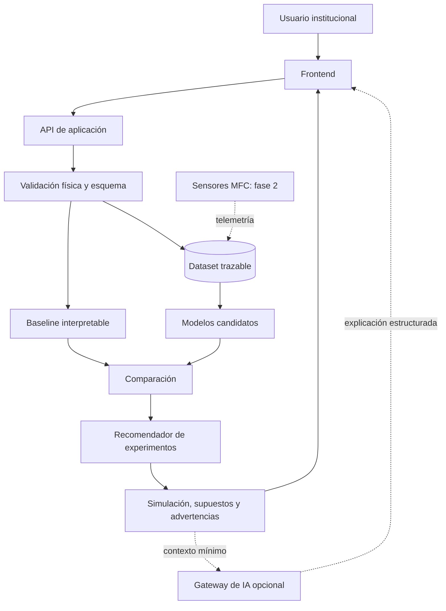

# GreenSpark: Documento técnico con investigación

**Equipo:** HackHeroes · **Hackathon:** Build With AI 2026 · **Mención:** Energía · **Lugar:** Santa Cruz de la Sierra, Bolivia

**Fecha:** 31 de mayo de 2026

> **En una frase:** GreenSpark diseña y simula una ruta de economía circular basada inicialmente en reactores MFC para investigar la conversión de residuos bioorgánicos en electricidad y, cuando exista evidencia y volumen suficiente, evaluar biodigestores para escalar capacidad.

## 0. Nota de honestidad técnica

Este documento distingue cuatro tipos de información:

- **[DATO]:** información publicada por una fuente verificable.
- **[CÁLCULO]:** operación explícita derivada de un dato.
- **[SIMULACIÓN]:** resultado generado por un modelo o escenario, todavía no observado en un reactor local.
- **[META EXPLORATORIA]:** objetivo sujeto a medición y validación.

GreenSpark no presenta un reactor físico construido por el equipo ni electricidad medida durante la hackathon. El entregable es un diseño respaldado por investigación, una simulación conceptual y una hoja de ruta experimental. Tampoco afirma que el subproducto sea un fertilizante comercial: su posible uso agronómico requiere caracterización, estabilización y revisión regulatoria.

## 1. Resumen ejecutivo

Santa Cruz de la Sierra produce **1.909,86 t/día** de residuos y el **50,84%** corresponde a residuos orgánicos compostables: aproximadamente **970,97 t/día**, redondeadas a **971 t/día** [DATO + CÁLCULO: `1.909,86 × 0,5084 = 970,97`]. En mayo de 2026 se inauguró una planta municipal de compostaje con capacidad inicial de hasta **7 t/día** y Swisscontact reportó más de **20 t/día** de residuos bioorgánicos en el Mercado Nuevo Abasto [DATO]. Estos avances demuestran que existe interés local y un flujo aprovechable, pero no agotan la necesidad de nuevas rutas circulares.

GreenSpark propone tres fases:

1. **Investigación universitaria:** diseño y simulación de reactores de celdas de combustible microbianas (MFC).
2. **Pilotos instrumentados:** módulos MFC con colegios privados, restaurantes y agroindustrias.
3. **Escalamiento:** evaluación de biodigestores o configuraciones híbridas cuando exista suficiente volumen segregado.

La IA compara escenarios, estima rendimiento eléctrico proyectado, recomienda experimentos y traduce resultados en métricas de sostenibilidad. Su valor aumenta a medida que el piloto físico incorpora mediciones locales.

## 2. Contexto e investigación del problema

### 2.1 Evidencia local

| Evidencia | Interpretación |
| --- | --- |
| **1.909,86 t/día** de residuos sólidos y **50,84%** de orgánicos compostables según PMGIRS 2023. [Fuente](https://www.gmsantacruz.gob.bo/Noticias/Detalle/?id=517) | La materia bioorgánica es un flujo local relevante. |
| Planta municipal de compostaje con capacidad inicial de hasta **7 t/día**. [Fuente](https://www.swisscontact.org/es/noticias/un-nuevo-rumbo-para-los-residuos-organicos-santa-cruz-inaugura-su-planta-de-compostaje) | Existen avances locales, pero también espacio para rutas complementarias. |
| Más de **20 t/día** de residuos bioorgánicos reportados en el Mercado Nuevo Abasto. [Fuente](https://www.swisscontact.org/es/noticias/nace-una-alternativa-sostenible-para-la-gestion-y-aprovechamiento-de-los-residuos-organicos) | Hay generadores concentrados que pueden facilitar estudios futuros. |
| DS 4477, modificado por DS 5167 y DS 5549. [Fuente](https://www.aetn.gob.bo/docfly/app/webroot/uploads/26/8998-P5JK.pdf) | Bolivia regula la generación distribuida con fuentes renovables y distingue mecanismos según escala. Una futura solución conectada a red debe validar su encaje técnico y regulatorio con la AETN y la empresa distribuidora. |

### 2.2 Problema definido

Las instituciones de Santa Cruz de la Sierra interesadas en economía circular no cuentan con datos locales suficientes para decidir qué residuos bioorgánicos conviene valorizar energéticamente, qué rendimiento esperar de una configuración MFC ni cuándo escalar hacia tecnologías de mayor capacidad. Esta incertidumbre aumenta el riesgo de invertir en infraestructura sobredimensionada o comunicar ahorros que todavía no pueden demostrarse.

El desafío es construir una ruta de investigación que permita **comparar escenarios, priorizar experimentos y reemplazar supuestos con mediciones locales** antes de escalar.

### 2.3 Causas y consecuencias

| Causa | Consecuencia |
| --- | --- |
| No existen mediciones propias que relacionen sustrato, operación y configuración MFC con rendimiento eléctrico local. | Las decisiones se apoyan en literatura general y no en evidencia cruceña. |
| Los residuos bioorgánicos varían por origen, composición y contaminación. | Un piloto puede rendir de forma distinta según el generador y el lote. |
| Las MFC y los biodigestores responden a escalas y objetivos diferentes. | Elegir una tecnología sin medir volumen y demanda puede conducir a inversiones inadecuadas. |
| Los indicadores técnicos son difíciles de comunicar a usuarios no especializados. | La sostenibilidad se presenta como discurso general en lugar de métricas trazables. |

### 2.4 Cliente inicial

El primer cliente no es toda la ciudad. Son **universidades privadas** capaces de financiar investigación aplicada y utilizar su campus como laboratorio vivo. Su incentivo combina aprendizaje, reputación, participación estudiantil y métricas de sostenibilidad.

Consulta el análisis ampliado en [problema identificado](<./01 problema identificado.md>).

## 3. Objetivos

### 3.1 Objetivo general

Diseñar una ruta técnica verificable para investigar la conversión de residuos bioorgánicos de Santa Cruz de la Sierra en electricidad mediante reactores MFC, utilizando simulación asistida por IA para priorizar experimentos y preparar pilotos físicos instrumentados.

### 3.2 Objetivos específicos

1. Documentar las variables del sustrato, la operación y el reactor que afectan el rendimiento MFC.
2. Diferenciar datos publicados, simulaciones, mediciones y metas exploratorias.
3. Diseñar un pipeline que compare un baseline interpretable con modelos predictivos candidatos.
4. Priorizar escenarios experimentales con criterios técnicos, económicos y de disponibilidad local.
5. Traducir resultados estructurados en reportes comprensibles sin delegar cálculos críticos a un LLM.
6. Definir cómo incorporar telemetría local y evaluar escalamiento cuando exista evidencia suficiente.

## 4. Alcance y limitaciones

### 4.1 Incluido en el entregable de hackathon

- investigación del problema local y fundamento técnico de MFC;
- diseño conceptual del reactor y variables experimentales;
- arquitectura propuesta para simulación, trazabilidad y reportes;
- contratos de entrada y salida para escenarios MFC;
- estrategia de baseline, modelos candidatos y evaluación;
- diseño de un agente explicativo opcional con controles anti-alucinación;
- hoja de ruta para piloto instrumentado y escalamiento.

### 4.2 Fuera de alcance durante la hackathon

- reactor físico construido por el equipo;
- aplicación ejecutable desplegada;
- electricidad medida en condiciones locales;
- modelo predictivo entrenado y evaluado con datos locales;
- conexión o venta de energía a la red;
- garantía de ahorro energético;
- fertilizante comercial certificado;
- créditos de carbono.

> Debido al tiempo limitado de la hackathon y la ausencia de hardware físico, GreenSpark prioriza un diseño investigativo transparente sobre una integración incompleta presentada como producto terminado.

## 5. Investigación técnica

### 5.1 Fundamento MFC

Una celda de combustible microbiana o **MFC** es un sistema bioelectroquímico. En la cámara anódica, microorganismos oxidan materia orgánica y liberan electrones. Estos circulan por un circuito externo hacia el cátodo y producen corriente eléctrica.

```text
Residuo bioorgánico acondicionado
   → cámara anódica: actividad microbiana
   → liberación de electrones y protones
   → circuito externo: corriente eléctrica
   → cámara catódica: reacción de reducción
```

El rendimiento depende del sustrato, el diseño, los materiales, el pH, la temperatura y la resistencia externa. Una revisión académica de 2025 identifica como barreras para la comercialización la baja densidad de potencia, el costo de electrodos, la estabilidad operativa y la escalabilidad. Por eso GreenSpark plantea MFC como una ruta de investigación y piloto, no como una fuente comercial demostrada.

### 5.2 Hallazgos de la literatura que condicionan el diseño

| Hallazgo verificado | Decisión para GreenSpark |
| --- | --- |
| Una revisión de 2025 describe a las MFC como sistemas que convierten materia orgánica en electricidad mediante actividad microbiana, pero todavía identifica barreras de potencia, costo y escalamiento. | Empezar con investigación y telemetría; no prometer cobertura eléctrica sin medición. |
| Un estudio comparativo entre MFC y digestión anaerobia encontró diferencias de biodegradación y generación eléctrica según el sustrato; la digestión anaerobia produjo más corriente en ese estudio, mientras la MFC entregó voltaje más estable y electricidad directamente utilizable. | Comparar tecnologías con datos del generador antes de elegir una ruta de mayor capacidad. |
| Un estudio de 2025 evaluó regresión lineal, Random Forest, KNN y Gradient Boosting para predecir voltaje y densidad de potencia en MFC con residuos de suelo y ganadería. | Mantener un baseline interpretable y comparar candidatos; no fijar un modelo ganador antes de evaluar el dataset local. |
| La recuperación de fósforo como estruvita está documentada en un sistema MFC alimentado con orina separada en origen. | Tratar la recuperación agronómica como hipótesis específica por sustrato; no extrapolarla automáticamente a residuos alimentarios. |

### 5.3 Alternativas evaluadas

| Necesidad | Alternativa | Ventaja | Limitación | Decisión |
| --- | --- | --- | --- | --- |
| Valorización inicial | Compostaje | Tecnología útil y ya aplicada localmente. | Prioriza valorización material, no investigación de generación eléctrica directa. | Complementaria. |
| Mayor capacidad energética | Biodigestor desde el inicio | Mayor madurez para procesar volumen y producir biogás. | Requiere sustrato suficiente, infraestructura e inversión mayor. | Evaluar en fase 3. |
| Investigación bioelectroquímica | MFC sin fase investigativa | Narrativa atractiva. | Riesgo alto de sobreprometer potencia y ahorro. | Descartada. |
| Ruta elegida | Investigación MFC, simulación y piloto | Permite aprender, medir y escalar con evidencia. | Requiere disciplina experimental. | **Elegida.** |
| Predicción | Reglas fijas | Transparentes y económicas. | No aprenden interacciones complejas. | Conservar como baseline y control. |
| Predicción | Modelos supervisados | Pueden comparar relaciones y mejorar con datos locales. | Exigen dataset trazable y evaluación. | Propuestos después del baseline. |
| Explicación | LLM por API | Traduce resultados técnicos a lenguaje comprensible. | Puede alucinar y generar dependencia externa. | Opcional, desacoplado y sin cálculos críticos. |

## 6. Justificación del uso de IA

La IA responde una pregunta concreta:

> **¿Qué configuración de reactor MFC y qué mezcla de sustrato conviene validar primero para maximizar un rendimiento eléctrico estable bajo condiciones definidas?**

La IA aporta valor en cuatro niveles:

1. compara relaciones entre sustrato, operación y configuración;
2. estima rendimiento eléctrico proyectado;
3. prioriza experimentos antes de construir múltiples prototipos;
4. explica resultados estructurados a usuarios no especializados.

La literatura reciente respalda explorar IA para predicción, monitoreo y optimización de MFC. GreenSpark adopta esa idea como hipótesis técnica: baseline primero, evaluación reproducible después y telemetría local antes de utilizar una predicción para decidir una inversión.

Las reglas determinísticas conservan el control de rangos físicos, cálculos críticos y etiquetas de evidencia. Un modelo más complejo solo se justifica si mejora de forma consistente frente al baseline. El LLM opcional redacta explicaciones, pero no inventa potencia, ahorro ni emisiones.

Consulta el detalle en [aplicación de IA](<./06 aplicacion de ia.md>).

## 7. Arquitectura de la solución

### 7.1 Componentes principales

| Componente | Responsabilidad |
| --- | --- |
| **Frontend institucional** | Capturar variables, mostrar etiquetas y comparar escenarios. |
| **API de aplicación** | Orquestar validación, persistencia, modelos y respuesta estructurada. |
| **Reglas y cálculos** | Validar rangos físicos y calcular métricas controladas. |
| **Baseline y modelos candidatos** | Estimar resultados proyectados y comparar desempeño. |
| **Recomendador** | Ordenar experimentos con criterios visibles. |
| **Gateway de IA opcional** | Encapsular el proveedor LLM y validar explicaciones. |
| **Persistencia** | Conservar escenarios, fuentes, estados y versiones. |
| **Telemetría de fase 2** | Incorporar mediciones del reactor físico. |

### 7.2 Flujo general



> **Nota:** el diagrama representa una arquitectura propuesta. No demuestra que los componentes estén implementados en el checkout actual.

La arquitectura separa predicción, explicación y evidencia física. Consulta el detalle en [arquitectura tecnológica](<./07 arquitectura tecnologica.md>).

## 8. Stack tecnológico propuesto

El checkout actual es documental. Las versiones exactas deben fijarse al iniciar una implementación.

| Capa | Tecnología | Justificación | Estado |
| --- | --- | --- | --- |
| **Frontend** | React | Permite construir un panel interactivo para comparar escenarios. | **[PROPUESTO]** |
| **Backend** | Python + FastAPI | Integra validación, APIs y herramientas científicas con baja complejidad inicial. | **[PROPUESTO]** |
| **Persistencia MVP** | SQLite | Reduce operación durante la validación del flujo. | **[PROPUESTO]** |
| **Persistencia escalada** | PostgreSQL | Soporta telemetría y operación multiinstitución. | **[FASE 3]** |
| **Datos** | pandas + numpy | Facilitan preparación y análisis reproducible. | **[PROPUESTO]** |
| **ML** | scikit-learn | Permite evaluar un baseline lineal y candidatos como Random Forest o Gradient Boosting sin infraestructura compleja. La selección final depende del dataset y las métricas observadas. | **[PROPUESTO]** |
| **Explicación** | LLM por API | Redacta reportes comprensibles a partir de contexto mínimo estructurado. | **[OPCIONAL]** |
| **Piloto físico** | Microcontrolador + sensores | Registra voltaje, corriente, pH y temperatura. | **[FASE 2]** |

## 9. Modelo de datos

| Entidad | Propósito | Campos principales |
| --- | --- | --- |
| **Institución** | Identificar al actor que investiga o pilota. | `id`, `nombre`, `tipo`, `zona` |
| **Sustrato** | Registrar origen y calidad del residuo. | `id`, `nombre`, `origen`, `humedad_pct`, `cod_estimado_mg_l`, `contaminacion_pct` |
| **ConfiguraciónMFC** | Describir el reactor evaluado. | `volumen_l`, `area_electrodo_cm2`, `material`, `distancia_cm`, `resistencia_ohm` |
| **Escenario** | Combinar sustrato, operación y reactor. | `ph`, `temperatura_c`, `retencion_h`, `estado_dato`, `fuente` |
| **Predicción** | Conservar resultados proyectados y versión del modelo. | `voltaje_v`, `corriente_ma`, `potencia_mw`, `densidad_mw_m2`, `confianza`, `version_modelo` |
| **Recomendación** | Explicar qué experimento priorizar. | `prioridad`, `explicacion`, `supuestos`, `advertencias` |
| **LecturaSensor** | Incorporar telemetría en fase 2. | `fecha_hora`, `voltaje_v`, `corriente_ma`, `ph`, `temperatura_c` |
| **Reporte** | Entregar un resumen institucional trazable. | `periodo`, `estado_dato`, `texto`, `version_generador` |

`estado_dato` debe distinguir `SIMULADO`, `MEDIDO` y `META_EXPLORATORIA`.

## 10. Lógica del sistema

1. El usuario registra tipo y masa de residuo, humedad, pH, temperatura y configuración MFC.
2. El backend valida esquema y rangos físicos antes de persistir.
3. Las reglas determinísticas calculan indicadores controlados.
4. El baseline y los modelos candidatos estiman rendimiento proyectado.
5. El sistema compara resultados y ordena experimentos según potencia, estabilidad, disponibilidad local, costo experimental e incertidumbre.
6. La API devuelve una respuesta estructurada con supuestos, advertencias y versión del modelo.
7. Si se solicita un reporte, el gateway entrega contexto mínimo a un LLM opcional y valida que no aparezcan cifras nuevas.
8. Durante la fase 2, la telemetría permite contrastar predicción con medición y mejorar el dataset local.

## 11. Diseño de interacción con IA

### 11.1 Entrada estructurada

```json
{
  "scenario_id": "mfc-scz-001",
  "estado_dato": "SIMULADO",
  "sustrato": {
    "tipo_residuo": "residuo_alimentario",
    "masa_kg": 5,
    "humedad_pct": 72
  },
  "operacion": {
    "ph": 7,
    "temperatura_c": 28,
    "retencion_h": 48
  },
  "reactor": {
    "volumen_l": 10,
    "area_electrodo_cm2": 120,
    "material_electrodo": "carbon",
    "distancia_electrodos_cm": 4,
    "resistencia_externa_ohm": 1000
  }
}
```

### 11.2 Regla para el agente explicativo

```text
Explica únicamente los resultados estructurados recibidos.
No calcules ni inventes potencia, ahorro, emisiones o porcentajes.
Diferencia datos publicados, simulaciones, mediciones y metas exploratorias.
Si falta información, decláralo de forma explícita.
```

### 11.3 Controles aplicados

| Control | Propósito |
| --- | --- |
| Validación de rangos físicos | Rechazar entradas inválidas antes de invocar modelos. |
| Esquema estructurado | Evitar respuestas libres difíciles de validar. |
| Etiquetado obligatorio | Separar `SIMULADO`, `MEDIDO` y `META_EXPLORATORIA`. |
| Cálculos fuera del LLM | Mantener métricas críticas bajo control determinístico. |
| Contexto mínimo | Reducir exposición de datos y riesgo de alucinación. |
| Fallback | Conservar respuesta determinística si falla el modelo o la API externa. |
| Control humano | Presentar recomendaciones como apoyo, no como orden automática. |

## 12. Validación del prototipo

### 12.1 Estado actual

El repositorio documenta el diseño conceptual. No corresponde reportar métricas medidas del modelo ni electricidad producida por un reactor local.

### 12.2 Hipótesis y método de validación

| Código | Hipótesis | Método de validación |
| --- | --- | --- |
| **H1** | Una universidad privada pagaría por investigación aplicada y métricas de sostenibilidad. | Entrevistas, carta de interés y propuesta de convenio. |
| **H2** | Los residuos locales pueden segregarse con consistencia suficiente para experimentos MFC. | Registro de tipo, masa, frecuencia y contaminación. |
| **H3** | Un modelo puede priorizar escenarios mejor que una regla fija. | Comparación mediante MAE, RMSE y R² frente a baseline, con partición de datos y validación cruzada cuando el volumen lo permita. |
| **H4** | Un piloto físico permite construir un dataset local útil. | Medición de voltaje, corriente, potencia, pH, temperatura y estabilidad. |
| **H5** | El volumen segregado puede justificar una evaluación posterior de biodigestores. | Inventario por generador y estudio de prefactibilidad. |
| **H6** | El subproducto posee potencial agronómico después del tratamiento correspondiente. | Caracterización fisicoquímica, estabilización y revisión regulatoria. |

### 12.3 Casos mínimos de prueba para una implementación futura

1. escenario válido con variables completas;
2. escenario con datos faltantes;
3. escenario con valores físicamente inválidos;
4. comparación de dos configuraciones;
5. fallo del modelo o de la API externa;
6. telemetría anómala simulada para preparar la fase 2.

## 13. Riesgos técnicos y mitigaciones

| Riesgo | Impacto | Mitigación |
| --- | --- | --- |
| Dataset inicial pequeño | Predicción poco confiable. | Baseline interpretable, validación cruzada y reentrenamiento con datos locales. |
| Datos sintéticos confundidos con evidencia | Sobrepromesa técnica. | Etiquetas visibles y separación estricta entre simulación y medición. |
| Alucinación del LLM | Reporte incorrecto. | Contexto mínimo, esquema estructurado, cálculos fuera del LLM y fallback. |
| Sesgo por literatura no local | Priorización débil para Santa Cruz. | Registrar fuentes y sustituir supuestos con telemetría del piloto. |
| Dependencia de API externa | Fallo, latencia o costo elevado. | Mantener el LLM opcional y medir antes de seleccionar proveedor. |
| Potencia MFC insuficiente | Caso de uso energético inviable. | Validar por fases y evaluar biodigestores o soluciones híbridas al escalar. |
| Sustrato variable o contaminado | Resultados poco estables. | Registrar composición, fuente y criterios de aceptación. |

## 14. Impacto esperado

| Dimensión | Resultado esperado | Cómo se mide |
| --- | --- | --- |
| **Investigación** | Decisiones experimentales basadas en escenarios comparables. | Escenarios evaluados, supuestos documentados y protocolo priorizado. |
| **IA** | Priorización verificable frente a una regla simple. | MAE, RMSE y R² contra baseline. |
| **Circularidad** | Trazabilidad de residuos bioorgánicos utilizados. | Masa segregada, masa procesada y destino del subproducto. |
| **Energía** | Aporte medido o proyectado a cargas seleccionadas. | `kWh generados / kWh consumidos por la carga elegida`, siempre separando simulación y medición. |
| **Educación** | Participación universitaria y aprendizaje aplicado. | Sesiones, estudiantes involucrados y retroalimentación. |
| **Escalamiento** | Decisión informada sobre piloto o biodigestor. | Volumen, demanda, costo, desempeño y requisitos regulatorios. |

GreenSpark no fija un porcentaje de cobertura eléctrica antes de disponer de una línea base de consumo y mediciones físicas. Cualquier meta posterior debe indicar la carga seleccionada, el período, la fuente del dato y si el resultado es simulado o medido.

Consulta el detalle en [impacto esperado](<./05 impacto esperado.md>) y [análisis financiero](<./08 analisis financiero.md>).

## 15. Roadmap

| Etapa | Alcance | Evidencia requerida |
| --- | --- | --- |
| **Hackathon** | Investigación, diseño MFC, arquitectura, contratos y escenarios documentados. | Entregables coherentes y supuestos visibles. |
| **MVP investigativo** | Interfaz, API, baseline, modelos candidatos, recomendador y persistencia local. | Pruebas de flujo, trazabilidad y comparación frente a baseline. |
| **Piloto MFC** | Reactor físico, sensores, telemetría y dataset local. | Potencia, energía, estabilidad, pH, temperatura y calidad del sustrato medidos. |
| **Operación multiinstitución** | Monitoreo, autenticación, auditoría y reportes recurrentes. | Convenios, renovaciones y carga operativa observada. |
| **Escalamiento energético** | Prefactibilidad de biodigestor o solución híbrida. | Volumen, demanda, costos y revisión regulatoria. |

## 16. Marco regulatorio

El **DS 4477** estableció el marco boliviano para generación distribuida con fuentes renovables. El **DS 5167** incorporó modificaciones en 2024 y el **DS 5549**, promulgado el **18 de febrero de 2026**, volvió a modificar el marco. El DS 5549 define escalas, exige autorización de la AETN para el autoproductor y distingue dos rutas: compensación económica mensual para generación distribuida conectada a la red y venta mediante contrato con la empresa distribuidora para proyectos de media escala.

GreenSpark no afirma que un piloto MFC pueda conectarse automáticamente a la red ni incorpora ingresos por excedentes en su escenario base. La aplicabilidad del marco a una futura solución MFC, biodigestor o sistema híbrido debe confirmarse con la **AETN** y la empresa distribuidora antes de diseñar una conexión.

Para GreenSpark, la secuencia correcta es:

1. investigar y medir;
2. priorizar autoconsumo en cargas seleccionadas;
3. evaluar requisitos técnicos, registro y adecuaciones;
4. confirmar la fuente renovable, escala y modalidad aplicable con la AETN y la empresa distribuidora;
5. estudiar compensación o contrato por excedentes únicamente si el escalamiento lo permite.

## 17. Fuentes consultadas

### 17.1 Contexto local y normativa

- [GAMSC: campaña CompostArte y datos del PMGIRS 2023](https://www.gmsantacruz.gob.bo/Noticias/Detalle/?id=517)
- [Swisscontact: planta municipal de compostaje, 14/05/2026](https://www.swisscontact.org/es/noticias/un-nuevo-rumbo-para-los-residuos-organicos-santa-cruz-inaugura-su-planta-de-compostaje)
- [Swisscontact: Semilla Urbana, 28/04/2026](https://www.swisscontact.org/es/noticias/nace-una-alternativa-sostenible-para-la-gestion-y-aprovechamiento-de-los-residuos-organicos)
- [AETN: Decreto Supremo N.º 4477](https://www.aetn.gob.bo/docfly/app/webroot/uploads/norma-rloza-2021-05-27-i.pdf)
- [AETN: Decreto Supremo N.º 5167](https://www.aetn.gob.bo/docfly/app/webroot/uploads/AETN24-0611151515%28admin%29.pdf)
- [AETN: Decreto Supremo N.º 5549, promulgado el 18/02/2026](https://www.aetn.gob.bo/docfly/app/webroot/uploads/26/8998-P5JK.pdf)

### 17.2 Fundamento MFC, IA y recuperación de nutrientes

- [Bioresources and Bioprocessing: revisión crítica de MFC para bioenergía sostenible, 2025](https://link.springer.com/article/10.1186/s13068-025-02649-y)
- [Discover Sustainability: revisión de IA aplicada a MFC, 2025](https://link.springer.com/article/10.1007/s43621-025-01619-6)
- [Heliyon: predicción de potencia y voltaje MFC mediante aprendizaje automático, 2025](https://pmc.ncbi.nlm.nih.gov/articles/PMC11754162/)
- [Science of the Total Environment: estudio comparativo de MFC y digestión anaerobia](https://pubmed.ncbi.nlm.nih.gov/29428783/)
- [Environmental Science & Technology: recuperación de fósforo como estruvita mediante MFC alimentada con orina separada en origen](https://pubmed.ncbi.nlm.nih.gov/21411312/)

## 18. Conclusión técnica

GreenSpark presenta una ruta de innovación aplicada, no una central eléctrica terminada. La propuesta parte de un problema local verificable, utiliza IA donde puede reducir el costo de aprender y conserva cálculos críticos bajo control determinístico. La arquitectura permite comenzar con investigación universitaria, incorporar mediciones en un piloto MFC y decidir con evidencia cuándo evaluar biodigestores o soluciones híbridas de mayor capacidad.
