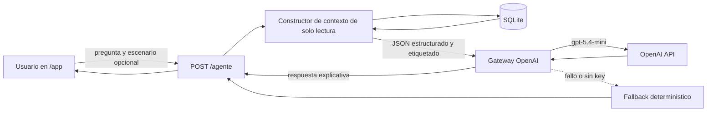

# GreenSpark: Agente OpenAI de analisis sobre SQLite

**Fecha:** 31 de mayo de 2026  
**Estado:** Diseno aprobado para implementacion  
**Base documental:** `docs/entregables_obligatorios/markdown/06 aplicacion de ia.md`

## 1. Objetivo

Convertir el asesor de sostenibilidad de GreenSpark en un agente funcional de
solo lectura que responda preguntas sobre los datos del prototipo almacenados en
SQLite. El agente debe analizar escenarios MFC, predicciones, recomendaciones,
reportes y telemetria ficticia sin presentar simulaciones como evidencia fisica.

OpenAI sera el unico proveedor LLM operativo de esta version. El modelo
seleccionado es `gpt-5.4-mini`, configurado exclusivamente desde el backend.

## 2. Alcance

### Incluye

- Configuracion backend para OpenAI mediante `OPENAI_API_KEY`.
- Uso de `gpt-5.4-mini` y `https://api.openai.com/v1`.
- Preguntas libres en el asesor IA de `/app`.
- Contexto estructurado de solo lectura construido por FastAPI desde SQLite.
- Consulta opcional enfocada en un escenario seleccionado.
- Resumen general de escenarios, predicciones, recomendaciones, reportes y
  telemetria.
- Telemetria ficticia reproducible: `24` lecturas por cada uno de los `8`
  escenarios existentes.
- Etiquetado obligatorio `SIMULADO` para la telemetria generada.
- Fallback deterministico basado en los mismos datos cuando falta la API key o
  falla OpenAI.
- Pruebas backend, build frontend y verificacion local de la ruta `/app`.

### No incluye

- Acceso SQL directo desde el modelo.
- Consultas SQL generadas por el modelo.
- Escrituras, modificaciones o eliminaciones de datos iniciadas por el agente.
- Sensores fisicos ni telemetria `MEDIDO`.
- Calculos criticos delegados al LLM.
- Cambios en `docs/entregables_obligatorios/markdown`.

## 3. Enfoques considerados

### Enfoque seleccionado: herramientas backend explicitas

FastAPI consulta SQLite mediante funciones de solo lectura y construye un
contexto JSON acotado. El LLM recibe la pregunta del usuario y ese contexto
estructurado. Este enfoque mantiene trazabilidad, limita tokens y evita exponer
la base de datos al modelo.

### Alternativas descartadas

- **Volcar toda la base en cada prompt:** simple, pero desperdicia tokens y
  mezcla datos irrelevantes.
- **Permitir SQL generado por el modelo:** flexible, pero agrega riesgos de
  seguridad y complejidad innecesarios para el prototipo.

## 4. Arquitectura



El modelo no conoce credenciales, rutas de archivos ni una conexion SQL. La API
es la unica capa con acceso a SQLite y OpenAI.

## 5. Contrato del agente

`POST /agente` aceptara:

```json
{
  "question": "¿Que escenario conviene validar primero y por que?",
  "scenario_id": null
}
```

`scenario_id` sera opcional. Si existe, el backend agregara el detalle y la
telemetria de ese escenario al resumen general. La respuesta conservara el
contrato visible actual:

```json
{
  "explanation": "Texto basado exclusivamente en datos del backend.",
  "source": "llm",
  "model": "gpt-5.4-mini",
  "warnings": [
    "Los datos analizados son SIMULADOS; no interpretar como mediciones fisicas."
  ]
}
```

`source` sera `fallback` cuando OpenAI no este configurado o no responda.

## 6. Contexto de solo lectura

El backend construira un resumen JSON compacto con:

- conteos de instituciones, sustratos, escenarios, predicciones,
  recomendaciones, reportes y lecturas;
- ranking de recomendaciones con codigo de escenario, prioridad y motivo;
- escenarios con sustrato, institucion, configuracion, variables operativas,
  ultima prediccion y estado de evidencia;
- reportes existentes con estado de evidencia;
- para el escenario seleccionado: detalle completo y resumen de telemetria;
- para preguntas globales: resumen de telemetria por escenario.

El resumen de telemetria incluira cantidad de lecturas, rango temporal, promedio,
minimo y maximo de voltaje, corriente, pH y temperatura. No se enviara una serie
temporal completa salvo que sea necesaria para el escenario seleccionado.

## 7. Telemetria ficticia

El seed de SQLite agregara `24` lecturas por escenario para demostrar analisis
temporal. Las lecturas seran reproducibles y coherentes con cada escenario:

- `192` lecturas totales;
- intervalos horarios;
- pequenas variaciones deterministicas;
- `device_id` identificable como simulador;
- `evidence_state=SIMULADO`.

La interfaz y el agente deben aclarar que estas lecturas preparan el flujo para
sensores futuros y no provienen de un reactor fisico.

## 8. Guardrails

El prompt del agente exigira:

1. usar solamente cifras presentes en el contexto;
2. declarar datos faltantes;
3. distinguir `SIMULADO`, `MEDIDO` y `META_EXPLORATORIA`;
4. aclarar que la telemetria actual es ficticia;
5. no afirmar que existen sensores fisicos instalados;
6. no inventar ahorro, emisiones, potencia ni porcentajes;
7. responder en espanol claro y breve;
8. explicar recomendaciones como apoyo para decidir el siguiente experimento,
   no como una orden automatica.

## 9. Experiencia en `/app`

El panel `Asesor IA` ofrecera:

- campo de pregunta libre;
- selector opcional de escenario;
- preguntas sugeridas para iniciar la demo;
- historial de conversacion;
- estado de espera visible;
- identificacion visible de `llm` o `fallback`;
- modelo usado cuando corresponda;
- advertencia persistente sobre datos simulados.

Preguntas sugeridas:

- `¿Que escenario conviene validar primero y por que?`
- `Resume la telemetria simulada del escenario seleccionado.`
- `¿Que datos faltan antes de construir un piloto fisico?`
- `Compara estabilidad y potencia proyectada.`

## 10. Configuracion

`.env.example` documentara:

```env
OPENAI_API_KEY=
AI_MODEL=gpt-5.4-mini
AI_BASE_URL=https://api.openai.com/v1
AI_TIMEOUT_SECONDS=30
```

La API key real vivira solamente en `.env`, archivo ignorado por Git. El
frontend nunca recibira la credencial.

## 11. Pruebas y verificacion

### Backend

- fallback sin API key;
- llamada OpenAI con URL, modelo y payload esperados;
- contexto global de SQLite;
- contexto enfocado en un escenario;
- telemetria etiquetada `SIMULADO`;
- endpoint `/agente` con pregunta libre;
- degradacion controlada si falla OpenAI.

### Frontend

- build TypeScript y Vite;
- campo de pregunta, selector y preguntas sugeridas;
- consumo del contrato actualizado;
- advertencia visible sobre simulacion.

### Verificacion local

- ejecutar `pytest`;
- ejecutar `npm run build`;
- levantar FastAPI y Vite;
- comprobar `/health`;
- abrir `/app?tab=agente`;
- realizar una consulta con fallback;
- realizar una consulta OpenAI cuando `OPENAI_API_KEY` este configurada.

## 12. Criterios de aceptacion

- OpenAI es el unico proveedor LLM documentado y configurado por defecto.
- El agente responde preguntas libres basadas en SQLite.
- El agente es estrictamente de solo lectura.
- Existen `192` lecturas ficticias y todas estan etiquetadas `SIMULADO`.
- La aplicacion sigue funcionando sin API key mediante fallback.
- La experiencia `/app` deja visible el origen de la respuesta y el caracter
  simulado de los datos.
- Los entregables obligatorios permanecen sin cambios.
