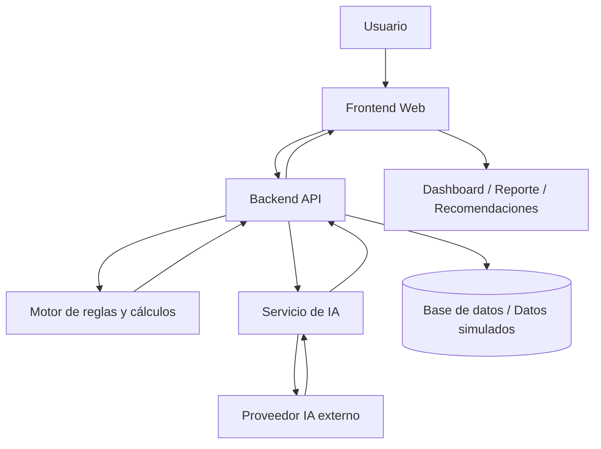
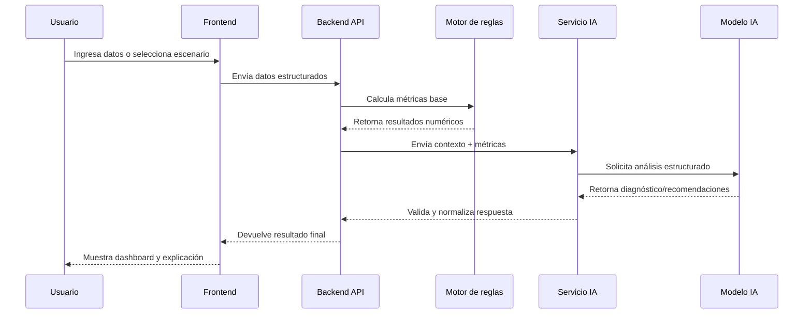

Aquí va la estructura recomendada para un **documento de arquitectura tecnológica de hackathon**, con foco en la defensa del uso de IA:Aquí el desglose de cada sección con las mejores prácticas:

---

## Sección 4 — Arquitectura de IA (la más importante para defender)

Esta es la sección que los jueces van a escrutar. Tiene que responder tres preguntas:

**¿Por qué IA y no una solución tradicional?**
Muestra que consideraste alternativas (reglas hardcodeadas, búsqueda clásica, etc.) y explica qué hace que la IA sea la elección correcta para este caso. Cuantifica si puedes: "un árbol de decisiones requeriría 200+ reglas manuales; el modelo lo infiere en contexto."

**¿Qué modelo y por qué ese específicamente?**
No basta con decir "usamos ChatGPT". Documenta: proveedor (OpenAI, Anthropic, Google, open-source), modelo exacto (GPT-4o, Claude Sonnet, Gemini Flash), y la justificación en al menos tres ejes: costo, latencia, capacidades necesarias (visión, código, multilingüe, longitud de contexto).

**¿Cómo está integrada la IA en el flujo?**
Dibuja el flujo de datos: dónde entra el input del usuario, qué preprocessing hace el sistema, qué recibe el modelo, cómo se postprocesa la salida. Si usas RAG, agentes, o function calling, explica cada componente.

---

## Mejores prácticas generales

**Sé honesto sobre las limitaciones.** Los jueces valoran la madurez técnica. Decir "el modelo alucinó en X% de los casos durante pruebas y lo mitigamos con validación de output" es mucho más fuerte que pretender que todo funciona perfecto.

**Muestra evidencia.** Capturas de prompts reales, ejemplos de inputs/outputs, métricas de latencia medidas durante el hackathon. Un número real vale más que diez afirmaciones.

**Separa lo que construiste de lo que usaste.** Los jueces distinguen entre "usamos la API de OpenAI" y "diseñamos la estrategia de prompting, el sistema de recuperación de contexto y la lógica de validación." Tu valor agregado es lo segundo.

**Diagrama de arquitectura obligatorio.** Un diagrama simple con cajas y flechas (usuario → API → modelo → respuesta) es imprescindible. Herramientas rápidas: Excalidraw, draw.io, o incluso una foto de un dibujo a mano.

**Stack completo en una tabla.** Incluye nombre, versión/modelo, propósito, y costo/plan usado. Demuestra que tienes visibilidad del sistema completo.

---

## Documento de Arquitectura Tecnológica para Hackathon

La idea no es hacer un paper de 40 páginas. En hackathon, el jurado quiere entender rápido:

> **Qué construyeron, cómo funciona, por qué tomaron esas decisiones técnicas, dónde entra la IA, qué riesgos controlaron y por qué es viable.**

Nada de humo tipo “usamos IA para revolucionar el mundo”. Eso no defiende nada. La IA se justifica cuando resuelve una parte concreta del problema mejor que una regla fija, un dashboard tradicional o un CRUD común. Ponete las pilas con eso. ⚙️

---

# 1. Portada técnica

Incluí:

```md
# Documento de Arquitectura Tecnológica

Proyecto: Nombre del proyecto  
Hackathon: Nombre del evento  
Equipo: Integrantes  
Fecha: DD/MM/YYYY  
Versión: 1.0  
Stack principal: React / Python / Node / FastAPI / Gemini / OpenAI / etc.
```

Debe verse formal, pero no universitario aburrido.

---

# 2. Resumen ejecutivo técnico

Máximo **8–12 líneas**.

Debe responder:

* ¿Qué problema técnico resuelve el sistema?
* ¿Cuál es la solución?
* ¿Dónde se usa IA?
* ¿Qué componentes tiene?
* ¿Cómo se despliega o ejecuta?
* ¿Por qué la arquitectura es viable para el tiempo del hackathon?

Ejemplo:

```md
El sistema propone una plataforma de análisis energético asistida por IA que permite estimar, visualizar y explicar oportunidades de eficiencia en instalaciones urbanas. La arquitectura se basa en una aplicación web modular, una API backend, un motor de análisis y una capa de IA mediante APIs externas. La IA se utiliza para interpretar datos, generar recomendaciones explicables y asistir en la toma de decisiones, mientras que las reglas determinísticas mantienen control sobre cálculos críticos. La solución prioriza rapidez de desarrollo, trazabilidad técnica y posibilidad de evolución hacia integración con hardware real.
```

---

# 3. Objetivo de la arquitectura

Acá explicás **para qué existe esta arquitectura**, no el proyecto entero.

Buena estructura:

```md
## Objetivo

Diseñar una arquitectura tecnológica que permita:

1. Capturar o simular datos relevantes.
2. Procesarlos mediante lógica determinística.
3. Usar IA para análisis, explicación y recomendación.
4. Presentar resultados comprensibles al usuario.
5. Mantener una separación clara entre frontend, backend, motor de IA y datos.
6. Permitir evolución futura hacia sensores, hardware o fuentes reales.
```

Clave: mostrás que no hiciste un Frankenstein improvisado.

---

# 4. Requisitos técnicos

Separá **funcionales** y **no funcionales**.

## 4.1 Requisitos funcionales

Ejemplo:

| Código | Requisito              | Descripción                                               |
| ------ | ---------------------- | --------------------------------------------------------- |
| RF-01  | Ingreso de datos       | El usuario puede cargar o seleccionar datos simulados     |
| RF-02  | Análisis energético    | El sistema procesa datos de consumo, ubicación o contexto |
| RF-03  | Recomendaciones con IA | La IA genera recomendaciones explicables                  |
| RF-04  | Visualización          | El sistema muestra resultados en dashboards o reportes    |
| RF-05  | Exportación            | El usuario puede obtener un resumen técnico o ejecutivo   |

## 4.2 Requisitos no funcionales

Estos importan mucho para defender arquitectura:

| Código | Requisito             | Decisión arquitectónica                             |
| ------ | --------------------- | --------------------------------------------------- |
| RNF-01 | Rapidez de desarrollo | Uso de APIs de IA en lugar de modelos locales       |
| RNF-02 | Modularidad           | Separación frontend/backend/IA/data                 |
| RNF-03 | Escalabilidad         | Backend desacoplado del proveedor de IA             |
| RNF-04 | Mantenibilidad        | Estructura por dominios o módulos                   |
| RNF-05 | Trazabilidad          | Registro de inputs, outputs y decisiones del modelo |
| RNF-06 | Seguridad             | No exponer API keys en frontend                     |
| RNF-07 | Explicabilidad        | La IA debe justificar sus recomendaciones           |

---

# 5. Vista general de arquitectura

Acá va el diagrama más importante.

Usá algo así:

```txt
[Usuario]
   |
   v
[Frontend Web]
   |
   v
[Backend/API]
   |
   +--> [Motor de reglas / cálculos]
   |
   +--> [Servicio de IA]
   |        |
   |        v
   |   [Proveedor IA: Gemini/OpenAI/etc.]
   |
   +--> [Base de datos / JSON / mock data]
   |
   v
[Respuesta estructurada]
   |
   v
[Dashboard / Reporte / Recomendaciones]
```

Mejor si lo hacen en **Mermaid**, porque queda técnico y limpio:



Este diagrama tiene que aparecer sí o sí. Sin diagrama, el documento parece chamuyo.

---

# 6. Stack tecnológico

No pongas solamente una lista. Tenés que justificar.

| Capa          | Tecnología                       | Justificación                                         |
| ------------- | -------------------------------- | ----------------------------------------------------- |
| Frontend      | React / Next.js / Angular        | Permite construir UI rápida, modular y demostrable    |
| Backend       | FastAPI / Express / NestJS       | Expone endpoints claros y separa lógica de negocio    |
| IA            | Gemini / OpenAI API / Vertex AI  | Reduce tiempo de implementación frente a modelo local |
| Datos         | JSON / SQLite / PostgreSQL       | Suficiente para prototipo y fácil de evolucionar      |
| Visualización | Recharts / Chart.js / D3         | Permite mostrar resultados comprensibles              |
| Deploy        | Local / Docker / Vercel / Render | Facilita demo rápida en hackathon                     |

Formato recomendado:

```md
## Stack tecnológico seleccionado

La arquitectura prioriza velocidad de desarrollo, claridad técnica y capacidad de demostración. Por ese motivo se seleccionaron tecnologías conocidas por el equipo, con bajo costo de integración y suficiente madurez para construir un prototipo funcional en el tiempo disponible.
```

---

# 7. Justificación del uso de IA

Esta sección es crítica. Acá ganás o perdés credibilidad.

## Mala justificación

```md
Usamos IA porque es innovadora y permite automatizar procesos.
```

Eso no dice nada. Basura técnica.

## Buena justificación

```md
La IA se utiliza en tareas donde el sistema necesita interpretar contexto, generar explicaciones en lenguaje natural y producir recomendaciones adaptadas a múltiples variables. Estas tareas son difíciles de resolver únicamente con reglas fijas, porque requieren priorizar información, sintetizar hallazgos y comunicar decisiones técnicas a usuarios no expertos.
```

## Estructura ideal para justificar IA

| Punto         | Pregunta que responde                    |
| ------------- | ---------------------------------------- |
| Problema      | ¿Qué parte del problema requiere IA?     |
| Función de IA | ¿Qué hace exactamente el modelo?         |
| Entrada       | ¿Qué datos recibe?                       |
| Salida        | ¿Qué produce?                            |
| Control       | ¿Cómo evitamos respuestas inventadas?    |
| Validación    | ¿Cómo verificamos si la respuesta sirve? |
| Alternativa   | ¿Qué pasaría sin IA?                     |

Ejemplo:

```md
## Uso de IA en la solución

La IA no reemplaza el motor de cálculo ni la lógica determinística del sistema. Su función es actuar como una capa de análisis, explicación y recomendación.

Entradas del modelo:
- Datos de consumo energético.
- Parámetros simulados del entorno.
- Resultados calculados por el sistema.
- Restricciones del usuario o del escenario.

Salidas esperadas:
- Diagnóstico resumido.
- Recomendaciones priorizadas.
- Explicación técnica en lenguaje natural.
- Posibles acciones de mejora.

Control de calidad:
- El modelo recibe datos estructurados.
- Las respuestas se solicitan en formato JSON.
- Los cálculos críticos no son generados por IA.
- Las recomendaciones deben estar justificadas con base en los datos de entrada.
```

---

# 8. Flujo de datos

El jurado necesita ver que sabés qué pasa con la información.



Esto demuestra que la IA no está tirada al azar. Hay pipeline. Hay control. Hay arquitectura.

---

# 9. Diseño del módulo de IA

No alcanza decir “usamos Gemini”. Eso es como decir “usamos martillo” sin explicar qué construiste.

Incluí:

## 9.1 Responsabilidad del módulo IA

```md
El módulo de IA tiene la responsabilidad de transformar datos técnicos y resultados del motor de análisis en recomendaciones comprensibles, priorizadas y explicables para el usuario.
```

## 9.2 Entradas

```json
{
  "scenario": "small_business_energy_usage",
  "monthly_consumption_kwh": 850,
  "peak_hours": ["18:00", "21:00"],
  "calculated_efficiency_score": 62,
  "detected_issues": [
    "high_peak_consumption",
    "possible_lighting_inefficiency"
  ]
}
```

## 9.3 Salida esperada

```json
{
  "diagnosis": "El consumo presenta picos elevados durante la tarde-noche.",
  "recommendations": [
    {
      "priority": "high",
      "action": "Optimizar iluminación en horarios pico",
      "reason": "Los datos muestran mayor demanda entre 18:00 y 21:00",
      "estimated_impact": "medium"
    }
  ],
  "risk_level": "medium",
  "explanation": "La recomendación se basa en el patrón de consumo detectado."
}
```

## 9.4 Guardrails

Importante:

```md
Para reducir alucinaciones, el modelo no genera cálculos numéricos críticos. Los cálculos son realizados previamente por el backend. La IA solo interpreta resultados ya procesados y debe responder en un esquema estructurado.
```

Esa frase vale oro en defensa técnica.

---

# 10. Arquitectura de carpetas o módulos

No siempre hace falta, pero suma si el proyecto es técnico.

Ejemplo para monorepo:

```txt
project-root/
├── apps/
│   ├── web/
│   │   ├── src/
│   │   ├── components/
│   │   ├── pages/
│   │   └── services/
│   │
│   └── api/
│       ├── src/
│       ├── routes/
│       ├── services/
│       ├── ai/
│       ├── rules/
│       └── data/
│
├── packages/
│   ├── shared-types/
│   └── config/
│
├── docs/
│   ├── architecture.md
│   ├── ai-usage.md
│   └── deployment.md
│
└── README.md
```

Justificación:

```md
La estructura separa aplicaciones, lógica compartida y documentación técnica. Esto permite mantener independencia entre frontend, backend y módulos de IA, evitando acoplamiento innecesario.
```

---

# 11. Decisiones arquitectónicas importantes

Esta sección te hace ver serio. Usá formato ADR simplificado.

| Decisión               | Alternativas              | Motivo                                      |
| ---------------------- | ------------------------- | ------------------------------------------- |
| Usar API externa de IA | Modelo local              | Menor tiempo de integración y mejor calidad |
| Monorepo               | Repos separados           | Coordinación más simple en hackathon        |
| Cálculos fuera del LLM | Cálculos generados por IA | Mayor confiabilidad                         |
| Respuestas JSON        | Texto libre               | Más fácil de validar y renderizar           |
| Datos simulados        | Hardware real             | Viable por tiempo y falta de sensores       |

Ejemplo:

```md
## Decisión: usar APIs externas de IA

Se decidió utilizar APIs externas de IA en lugar de ejecutar modelos locales debido a las restricciones de tiempo, hardware y confiabilidad del hackathon. Esta decisión permite concentrar el esfuerzo en la solución, la experiencia de usuario y la validación del caso de uso, en vez de invertir tiempo en infraestructura de modelos.
```

---

# 12. Seguridad y privacidad

Aunque sea hackathon, no podés ignorarlo.

Incluí:

```md
## Seguridad

- Las API keys no se exponen en el frontend.
- Las llamadas al proveedor de IA pasan por el backend.
- Los datos enviados al modelo se reducen al mínimo necesario.
- No se envían datos sensibles innecesarios.
- Se valida la entrada del usuario antes de procesarla.
- Se controla el formato de salida esperado del modelo.
```

Si usan datos simulados:

```md
Durante el prototipo se utilizan datos simulados, por lo que no se procesan datos personales ni información sensible real. Sin embargo, la arquitectura está preparada para incorporar controles adicionales si se integran fuentes reales.
```

---

# 13. Escalabilidad y evolución futura

Acá mostrás visión sin prometer humo.

| Fase       | Evolución                                      |
| ---------- | ---------------------------------------------- |
| Hackathon  | Datos simulados + IA vía API                   |
| MVP        | Base de datos real + usuarios + reportes       |
| Piloto     | Integración con sensores/API externas          |
| Producción | Monitoreo, autenticación, auditoría, costos IA |
| Escala     | Modelos especializados, RAG, cache, colas      |

Ejemplo:

```md
La arquitectura fue diseñada para comenzar como prototipo funcional, pero permitir evolución progresiva hacia una solución productiva. El desacoplamiento del módulo de IA permite cambiar de proveedor, incorporar RAG o añadir modelos especializados sin reescribir todo el sistema.
```

---

# 14. Riesgos técnicos y mitigaciones

Esto es MUY importante. El jurado confía más cuando reconocés riesgos.

| Riesgo                     | Impacto                     | Mitigación                                       |
| -------------------------- | --------------------------- | ------------------------------------------------ |
| Alucinaciones del modelo   | Recomendaciones incorrectas | Respuestas estructuradas y datos controlados     |
| Dependencia de API externa | Fallo durante demo          | Fallback con respuestas mockeadas                |
| Costos de IA               | Escalabilidad limitada      | Uso de prompts compactos y cache                 |
| Falta de hardware          | Menor validación real       | Simulación documentada y preparada para sensores |
| Latencia                   | Mala UX                     | Loading states y procesamiento asincrónico       |
| Datos insuficientes        | Diagnóstico débil           | Escenarios predefinidos y dataset simulado       |

Frase buena:

```md
El principal riesgo técnico es depender de un modelo generativo para recomendaciones. Para mitigarlo, la IA no opera como fuente única de verdad, sino como capa interpretativa sobre datos previamente calculados.
```

---

# 15. Métricas de éxito técnico

No pongas métricas imposibles. Poné métricas defendibles.

| Métrica                     | Objetivo                              |
| --------------------------- | ------------------------------------- |
| Tiempo de respuesta         | Menor a 5–8 segundos por análisis     |
| Completitud de respuesta IA | JSON válido en más del 90% de pruebas |
| Claridad de recomendación   | Cada recomendación debe incluir razón |
| Modularidad                 | Frontend, backend e IA separados      |
| Demo readiness              | Flujo completo ejecutable localmente  |
| Robustez                    | Fallback disponible si falla la API   |

---

# 16. Deployment y ejecución

En hackathon, esto debe ser simple.

```md
## Ejecución local

1. Clonar repositorio.
2. Configurar variables de entorno.
3. Instalar dependencias.
4. Ejecutar frontend.
5. Ejecutar backend.
6. Abrir aplicación en navegador.
```

También incluí variables:

```env
AI_PROVIDER_API_KEY=
DATABASE_URL=
APP_ENV=development
```

Y aclaración:

```md
El sistema puede ejecutarse localmente para facilitar la demo y evitar dependencia de infraestructura compleja durante la presentación.
```

---

# 17. Diagramas recomendados

Mínimo meté estos 3:

| Diagrama             | Para qué sirve                            |
| -------------------- | ----------------------------------------- |
| Arquitectura general | Muestra componentes principales           |
| Flujo de datos       | Muestra cómo circula la información       |
| Flujo de IA          | Muestra exactamente dónde entra el modelo |

Opcionales:

| Diagrama               | Cuándo usarlo                        |
| ---------------------- | ------------------------------------ |
| Diagrama de despliegue | Si tienen frontend/backend separados |
| Diagrama de módulos    | Si el repo está bien organizado      |
| Diagrama de secuencia  | Si quieren defender el flujo técnico |

---

# 18. Estructura final recomendada

Esta sería una estructura sólida:

```md
# Documento de Arquitectura Tecnológica

## 1. Resumen ejecutivo técnico
## 2. Objetivo de la arquitectura
## 3. Alcance del sistema
## 4. Requisitos técnicos
   ### 4.1 Requisitos funcionales
   ### 4.2 Requisitos no funcionales

## 5. Arquitectura general
   ### 5.1 Diagrama de componentes
   ### 5.2 Descripción de capas

## 6. Stack tecnológico
   ### 6.1 Frontend
   ### 6.2 Backend
   ### 6.3 IA
   ### 6.4 Datos
   ### 6.5 Deployment

## 7. Flujo de datos
## 8. Diseño del módulo de IA
   ### 8.1 Responsabilidad de la IA
   ### 8.2 Entradas del modelo
   ### 8.3 Salidas esperadas
   ### 8.4 Validación y guardrails
   ### 8.5 Limitaciones

## 9. Decisiones arquitectónicas
## 10. Seguridad y privacidad
## 11. Escalabilidad y evolución futura
## 12. Riesgos técnicos y mitigaciones
## 13. Métricas de éxito técnico
## 14. Guía de ejecución / despliegue
## 15. Conclusión técnica
```

---

# 19. Checklist para que el documento no dé vergüenza

Antes de entregarlo, revisen esto:

* [ ] ¿Hay un diagrama de arquitectura general?
* [ ] ¿Se entiende dónde entra la IA?
* [ ] ¿Se explica por qué IA y no reglas simples?
* [ ] ¿La IA tiene entradas y salidas claras?
* [ ] ¿Hay guardrails contra alucinaciones?
* [ ] ¿Las API keys están protegidas?
* [ ] ¿Hay justificación del stack?
* [ ] ¿Se mencionan riesgos?
* [ ] ¿Hay mitigaciones?
* [ ] ¿El sistema se puede ejecutar localmente?
* [ ] ¿La arquitectura coincide con lo que realmente construyeron?
* [ ] ¿El documento no promete cosas que no existen?

Esa última es clave. En hackathon podés vender bien, pero no podés mentir técnicamente. El jurado huele el humo.

---

# 20. Diferencia con el “Documento de Aplicación de IA”

No los mezclen, porque ahí se arma quilombo.

| Documento                             | Enfoque                                                                           |
| ------------------------------------- | --------------------------------------------------------------------------------- |
| Documento de Aplicación de IA         | Por qué se usa IA, qué valor aporta, ética, impacto, limitaciones                 |
| Documento de Arquitectura Tecnológica | Cómo está construido el sistema, componentes, stack, flujo, seguridad, despliegue |
| Análisis Financiero                   | Costos, ingresos, viabilidad económica                                            |
| PESTEL                                | Contexto político, económico, social, tecnológico, ambiental y legal              |

La arquitectura tecnológica debe ser más técnica, más concreta y menos narrativa.

---

# 21. Frase fuerte para defender ante jurado

Podés usar algo así:

```md
La arquitectura fue diseñada bajo una premisa: la IA no debe ser una caja mágica ni reemplazar la lógica crítica del sistema. Por eso se separa el motor determinístico de cálculo del módulo generativo. Los cálculos, validaciones y estructuras de datos son controlados por el backend; la IA se utiliza como una capa de interpretación, explicación y recomendación. Esto permite aprovechar la capacidad generativa del modelo sin comprometer la confiabilidad del sistema.
```

Esa frase está piola. Defiende muy bien el uso de IA sin sonar a “metimos ChatGPT y listo”. 🧠

---

## Recomendación final

Para un hackathon, el documento debería tener entre **5 y 10 páginas** si es PDF, o unas **1.500–2.500 palabras** si es Markdown. Más que eso probablemente nadie lo lea. Menos que eso puede parecer superficial.

La clave:

> **Arquitectura simple, IA bien delimitada, decisiones justificadas, riesgos reconocidos y demo ejecutable.**

No intenten parecer una empresa enterprise. Parezcan un equipo que entiende el problema, tomó buenas decisiones técnicas y sabe exactamente qué parte es prototipo y qué parte puede evolucionar.


---
